Retail Chain Transaction
================

# Retail Store Transaction Data

## Updating Libraries

``` r
library(rio)
library(formattable)
library(dplyr)
library(tidyverse)
library(readxl)
library(corrplot)
library(stargazer)
library(car)
library(PerformanceAnalytics)
library(tidyr)
library(tm)
library(MASS)
library(AER)
library(ggplot2)
library(lubridate)
library(lattice)
library(lme4)
library(MuMIn)
library("ggridges")
library("hrbrthemes")
library(ggthemes)
library("maps")
library("mapproj")
library(cowplot)
library(ROCR)

options(scipen = 999)
```

## Importing data

``` r
stores<-read_xlsx("RetailChain.xlsx",sheet = "stores")
products<-read_xlsx("RetailChain.xlsx",sheet = "products")
transactions<-read_xlsx("RetailChain.xlsx",sheet = "transactions")
```

## Joining product data and store data with transactions

``` r
df<-merge(transactions, products, by = 'UPC')
```

``` r
stores<-stores %>% 
  rename(
    STORE_NUM = STORE_ID
    )

df<-merge(df, stores, by = 'STORE_NUM')
```

## Dropping Oral Hygiene products from the analysis

``` r
df<-subset(df, CATEGORY!='ORAL HYGIENE PRODUCTS')
```

## Extracting Month and Year from date

``` r
str(df$WEEK_END_DATE)
```

    ##  POSIXct[1:418738], format: "2009-01-14" "2009-06-03" "2009-01-14" "2010-02-24" "2009-01-14" ...

``` r
df$month<-months(df$WEEK_END_DATE)
df$year<-year(df$WEEK_END_DATE)
```

## Extracting week of the month

``` r
x <- ymd(df$WEEK_END_DATE)

df$week<-week(x) - week(floor_date(x, unit = "months")) + 1
```

``` r
glimpse(df)
```

    ## Rows: 418,738
    ## Columns: 28
    ## $ STORE_NUM          <dbl> 367, 367, 367, 367, 367, 367, 367, 367, 367...
    ## $ UPC                <dbl> 1111009477, 7027316204, 1111085319, 7192100...
    ## $ WEEK_END_DATE      <dttm> 2009-01-14, 2009-06-03, 2009-01-14, 2010-0...
    ## $ UNITS              <dbl> 13, 15, 14, 1, 35, 2, 11, 10, 14, 24, 6, 1,...
    ## $ VISITS             <dbl> 13, 9, 13, 1, 27, 2, 11, 10, 13, 24, 6, 1, ...
    ## $ HHS                <dbl> 13, 9, 13, 1, 25, 2, 11, 10, 11, 23, 6, 1, ...
    ## $ SPEND              <dbl> 18.07, 26.25, 26.32, 6.99, 69.30, 12.76, 32...
    ## $ PRICE              <dbl> 1.39, 1.75, 1.88, 6.99, 1.98, 6.38, 2.99, 3...
    ## $ BASE_PRICE         <dbl> 1.57, 2.47, 1.88, 6.99, 1.98, 6.38, 2.99, 3...
    ## $ FEATURE            <dbl> 0, 0, 0, 0, 0, 0, 0, 0, 0, 0, 0, 0, 0, 0, 0...
    ## $ DISPLAY            <dbl> 0, 0, 0, 0, 0, 0, 0, 0, 0, 0, 0, 0, 0, 0, 0...
    ## $ TPR_ONLY           <dbl> 1, 1, 0, 0, 0, 0, 0, 0, 0, 1, 0, 0, 0, 1, 0...
    ## $ DESCRIPTION        <chr> "PL MINI TWIST PRETZELS", "SHURGD MINI PRET...
    ## $ MANUFACTURER       <chr> "PRIVATE LABEL", "SHULTZ", "PRIVATE LABEL",...
    ## $ CATEGORY           <chr> "BAG SNACKS", "BAG SNACKS", "COLD CEREAL", ...
    ## $ SUB_CATEGORY       <chr> "PRETZELS", "PRETZELS", "ALL FAMILY CEREAL"...
    ## $ PRODUCT_SIZE       <chr> "15 OZ", "16 OZ", "12.25 OZ", "29.8 OZ", "1...
    ## $ STORE_NAME         <chr> "15TH & MADISON", "15TH & MADISON", "15TH &...
    ## $ CITY               <chr> "COVINGTON", "COVINGTON", "COVINGTON", "COV...
    ## $ STATE              <chr> "KY", "KY", "KY", "KY", "KY", "KY", "KY", "...
    ## $ MSA                <dbl> 17140, 17140, 17140, 17140, 17140, 17140, 1...
    ## $ SEGMENT            <chr> "VALUE", "VALUE", "VALUE", "VALUE", "VALUE"...
    ## $ PARKING            <dbl> 196, 196, 196, 196, 196, 196, 196, 196, 196...
    ## $ SIZE               <dbl> 24721, 24721, 24721, 24721, 24721, 24721, 2...
    ## $ AVG_WEEKLY_BASKETS <dbl> 12706.53, 12706.53, 12706.53, 12706.53, 127...
    ## $ month              <chr> "January", "June", "January", "February", "...
    ## $ year               <dbl> 2009, 2009, 2009, 2010, 2009, 2009, 2010, 2...
    ## $ week               <dbl> 2, 1, 2, 4, 2, 4, 4, 3, 1, 4, 5, 2, 3, 4, 4...

``` r
colSums(is.na(df))
```

    ##          STORE_NUM                UPC      WEEK_END_DATE 
    ##                  0                  0                  0 
    ##              UNITS             VISITS                HHS 
    ##                  0                  0                  0 
    ##              SPEND              PRICE         BASE_PRICE 
    ##                  0                 10                173 
    ##            FEATURE            DISPLAY           TPR_ONLY 
    ##                  0                  0                  0 
    ##        DESCRIPTION       MANUFACTURER           CATEGORY 
    ##                  0                  0                  0 
    ##       SUB_CATEGORY       PRODUCT_SIZE         STORE_NAME 
    ##                  0                  0                  0 
    ##               CITY              STATE                MSA 
    ##                  0                  0                  0 
    ##            SEGMENT            PARKING               SIZE 
    ##                  0             282548                  0 
    ## AVG_WEEKLY_BASKETS              month               year 
    ##                  0                  0                  0 
    ##               week 
    ##                  0

``` r
df$PARKING<-NULL
df<-na.omit(df)
```

## Developing a model for Sales (Spend)

### Let us visualize the spend data

``` r
df2<-aggregate(df$SPEND, by=list(Category=df$WEEK_END_DATE), FUN=sum)
```

``` r
ggplot(df2, aes(x=Category, y=x)) +
  geom_line(color="RED3") + ylab("SPEND")
```

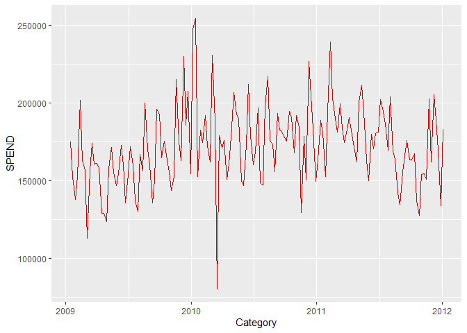<!-- -->

``` r
  xlab("")
```

    ## $x
    ## [1] ""
    ## 
    ## attr(,"class")
    ## [1] "labels"

``` r
ggplot(df, aes(x=df$SPEND)) + geom_density(color="coral",fill="coral")+ggtitle("Histogram of Spend")+xlab("Spend")
```

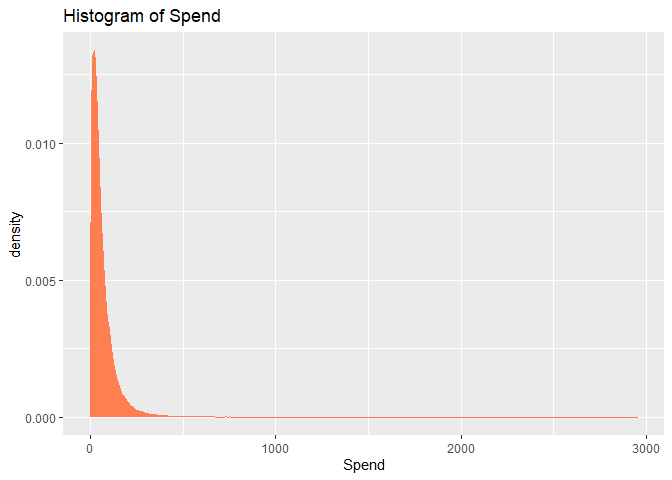<!-- -->

``` r
ggplot(df, aes(x=log(df$SPEND))) + geom_density(color="coral",fill="coral")+ggtitle("Histogram of Log Spend")+xlab("Log of Spend")
```

    ## Warning: Removed 1 rows containing non-finite values (stat_density).

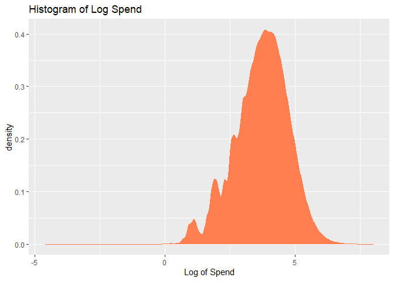<!-- -->

``` r
df %>%
  group_by(week) %>%
  ggplot()+
  geom_boxplot(aes(x=as.factor(week),y=log(SPEND),fill="coral"))+ylim(0,8)+
  guides(fill=FALSE)
```

    ## Warning: Removed 18 rows containing non-finite values (stat_boxplot).

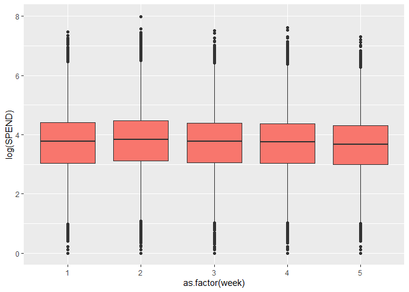<!-- -->

``` r
df %>%
  group_by(month) %>%
  ggplot()+
  geom_boxplot(aes(x=as.factor(month),y=log(SPEND),fill="coral"))+ylim(0,8)+
  guides(fill=FALSE)
```

    ## Warning: Removed 18 rows containing non-finite values (stat_boxplot).

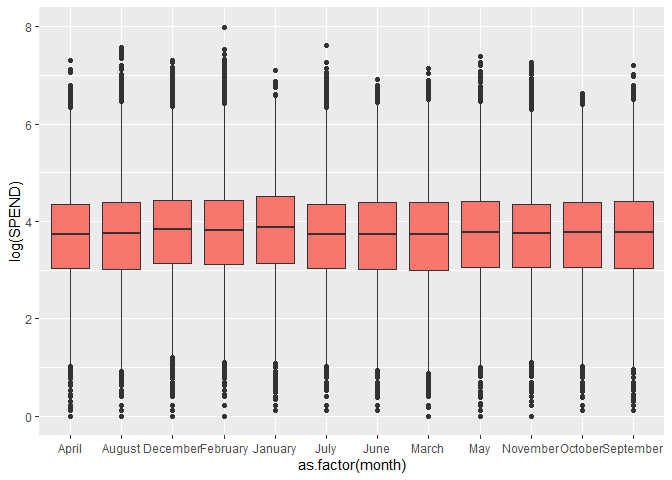<!-- -->

``` r
df %>%
  group_by(year) %>%
  ggplot()+
  geom_boxplot(aes(x=as.factor(year),y=log(SPEND),fill="coral"))+ylim(0,8)+
  guides(fill=FALSE)
```

    ## Warning: Removed 18 rows containing non-finite values (stat_boxplot).

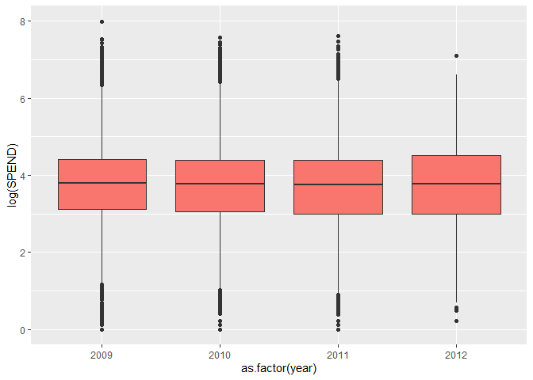<!-- -->

``` r
df %>%
  group_by(STATE) %>%
  ggplot()+
  geom_boxplot(aes(x=as.factor(STATE),y=log(SPEND),fill="coral"))+ylim(0,8)+
  guides(fill=FALSE)
```

    ## Warning: Removed 18 rows containing non-finite values (stat_boxplot).

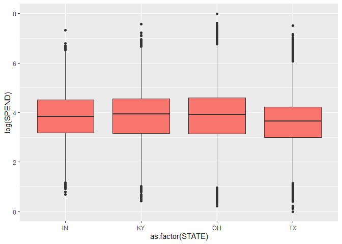<!-- -->

``` r
df %>%
  group_by(SEGMENT) %>%
  ggplot()+
  geom_boxplot(aes(x=as.factor(SEGMENT),y=log(SPEND),fill="coral"))+ylim(0,8)+
  guides(fill=FALSE)
```

    ## Warning: Removed 18 rows containing non-finite values (stat_boxplot).

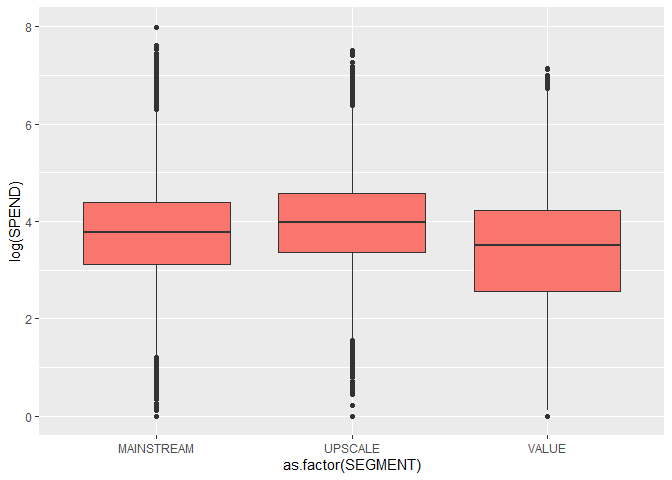<!-- -->

``` r
df %>%
  group_by(MANUFACTURER) %>%
  ggplot()+
  geom_boxplot(aes(x=as.factor(MANUFACTURER),y=log(SPEND),fill="coral"))+ylim(0,8)+
  guides(fill=FALSE)
```

    ## Warning: Removed 18 rows containing non-finite values (stat_boxplot).

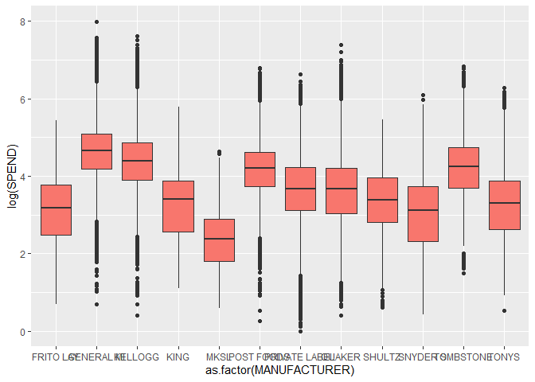<!-- -->

``` r
df %>%
  group_by(FEATURE) %>%
  ggplot()+
  geom_boxplot(aes(x=as.factor(FEATURE),y=log(SPEND),fill="coral"))+ylim(0,8)+
  guides(fill=FALSE)
```

    ## Warning: Removed 18 rows containing non-finite values (stat_boxplot).

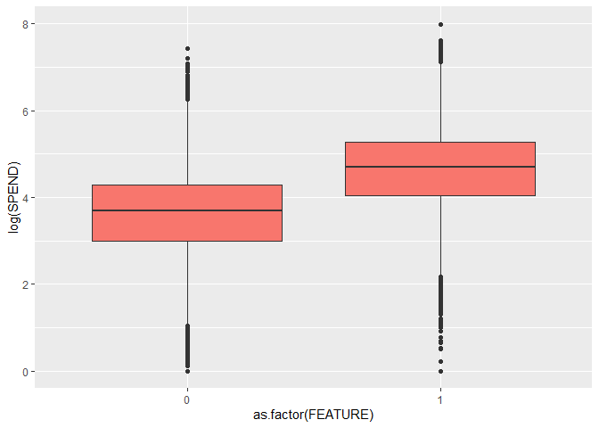<!-- -->

``` r
df %>%
  group_by(DISPLAY) %>%
  ggplot()+
  geom_boxplot(aes(x=as.factor(DISPLAY),y=log(SPEND),fill="coral"))+ylim(0,8)+
  guides(fill=FALSE)
```

    ## Warning: Removed 18 rows containing non-finite values (stat_boxplot).

<!-- -->

``` r
df %>%
  group_by(TPR_ONLY) %>%
  ggplot()+
  geom_boxplot(aes(x=as.factor(TPR_ONLY),y=log(SPEND),fill="coral"))+ylim(0,8)+
  guides(fill=FALSE)
```

    ## Warning: Removed 18 rows containing non-finite values (stat_boxplot).

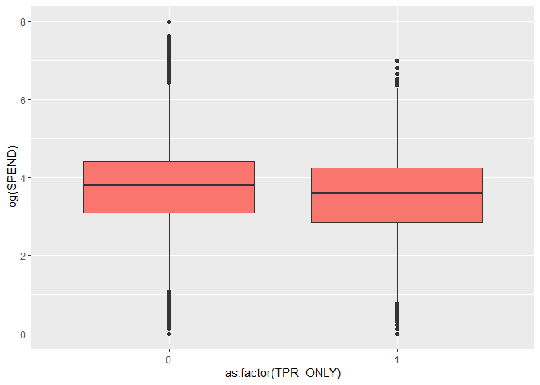<!-- -->

``` r
df2<-aggregate(df$UNITS, by=list(Category=df$WEEK_END_DATE), FUN=sum)
```

``` r
ggplot(df2, aes(x=Category, y=x)) +
  geom_line(color="RED3") + ylab("Units")
```

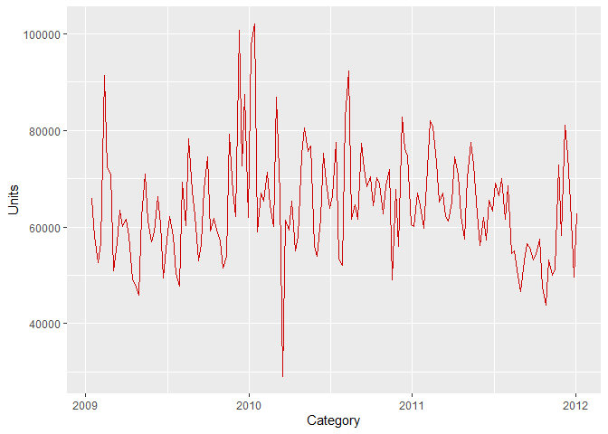<!-- -->

``` r
  xlab("")
```

    ## $x
    ## [1] ""
    ## 
    ## attr(,"class")
    ## [1] "labels"

``` r
ggplot(df, aes(x=df$UNITS)) + geom_density(color="seagreen",fill="seagreen")+ggtitle("Histogram of UNITS")+xlab("UNITS")
```

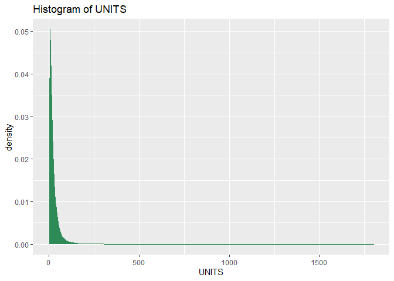<!-- -->

``` r
ggplot(df, aes(x=log(df$SPEND))) + geom_density(color="seagreen",fill="seagreen")+ggtitle("Histogram of Log UNITS")+xlab("Log of UNITS")
```

    ## Warning: Removed 1 rows containing non-finite values (stat_density).

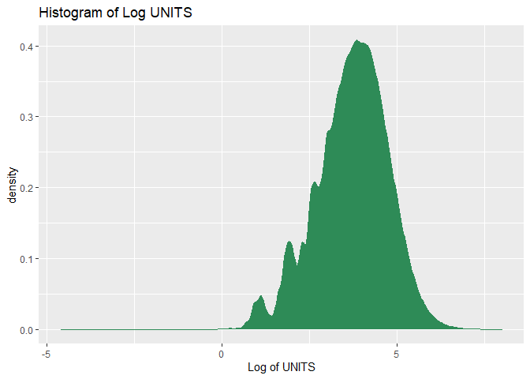<!-- -->

``` r
df %>%
  group_by(week) %>%
  ggplot()+
  geom_boxplot(aes(x=as.factor(week),y=log(UNITS),fill="coral"))+ylim(0,8)+
  guides(fill=FALSE)
```

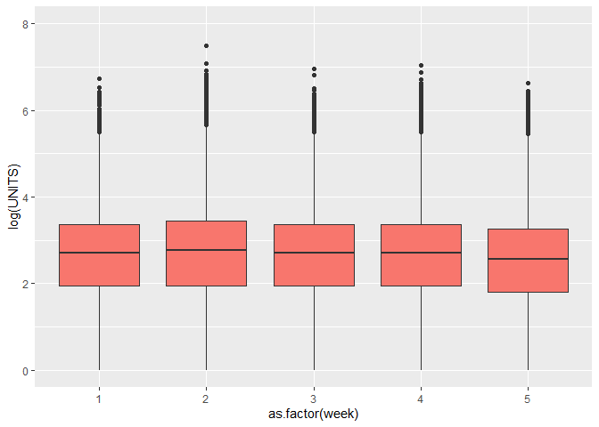<!-- -->

``` r
df %>%
  group_by(month) %>%
  ggplot()+
  geom_boxplot(aes(x=as.factor(month),y=log(UNITS),fill="seagreen"))+ylim(0,8)+
  guides(fill=FALSE)
```

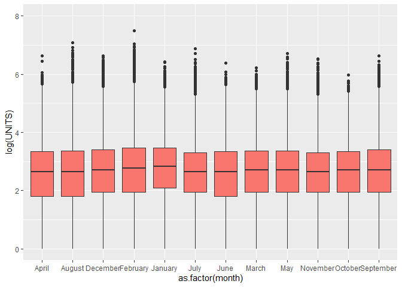<!-- -->

``` r
df %>%
  group_by(year) %>%
  ggplot()+
  geom_boxplot(aes(x=as.factor(year),y=log(UNITS),fill="seagreen"))+ylim(0,8)+
  guides(fill=FALSE)
```

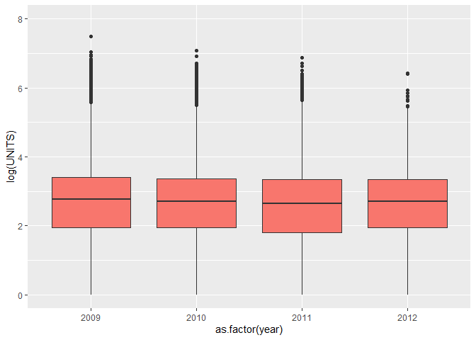<!-- -->

``` r
df %>%
  group_by(STATE) %>%
  ggplot()+
  geom_boxplot(aes(x=as.factor(STATE),y=log(UNITS),fill="seagreen"))+ylim(0,8)+
  guides(fill=FALSE)
```

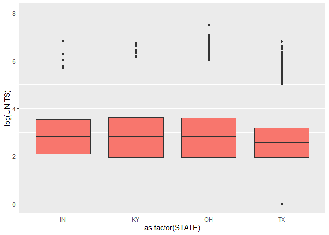<!-- -->

``` r
df %>%
  group_by(SEGMENT) %>%
  ggplot()+
  geom_boxplot(aes(x=as.factor(SEGMENT),y=log(UNITS),fill="seagreen"))+ylim(0,8)+
  guides(fill=FALSE)
```

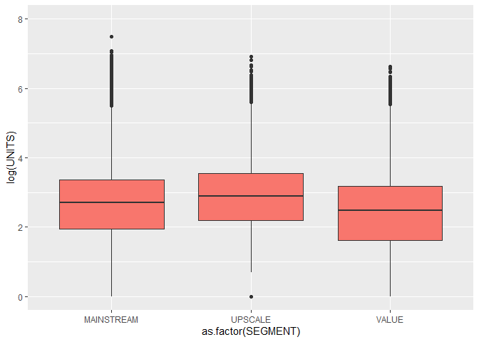<!-- -->

``` r
df %>%
  group_by(MANUFACTURER) %>%
  ggplot()+
  geom_boxplot(aes(x=as.factor(MANUFACTURER),y=log(UNITS),fill="seagreen"))+ylim(0,8)+
  guides(fill=FALSE)
```

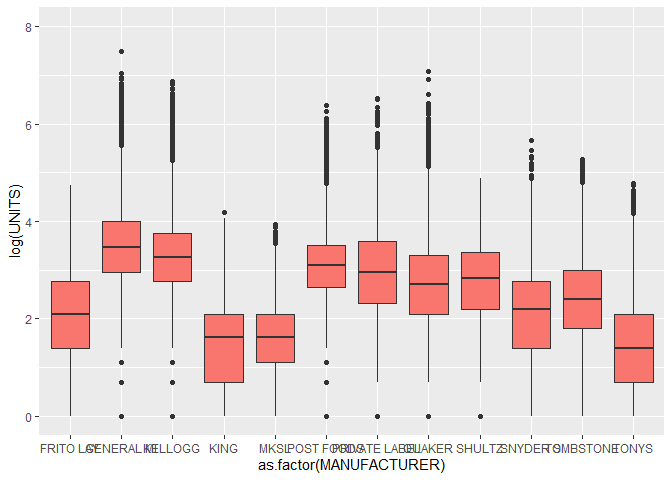<!-- -->

``` r
df %>%
  group_by(FEATURE) %>%
  ggplot()+
  geom_boxplot(aes(x=as.factor(FEATURE),y=log(UNITS),fill="seagreen"))+ylim(0,8)+
  guides(fill=FALSE)
```

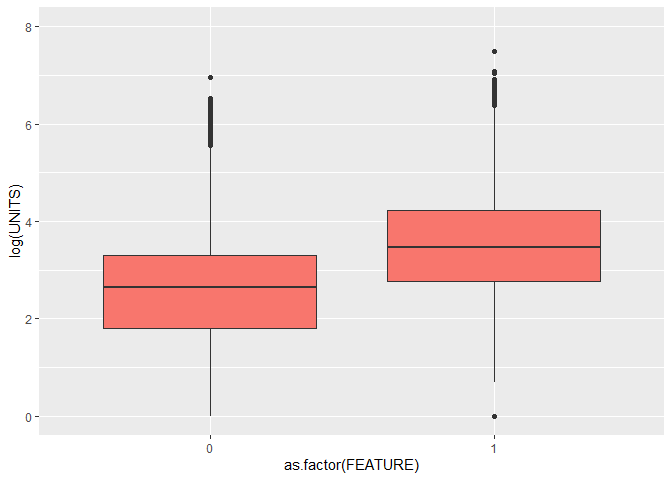<!-- -->

``` r
df %>%
  group_by(DISPLAY) %>%
  ggplot()+
  geom_boxplot(aes(x=as.factor(DISPLAY),y=log(UNITS),fill="seagreen"))+ylim(0,8)+
  guides(fill=FALSE)
```

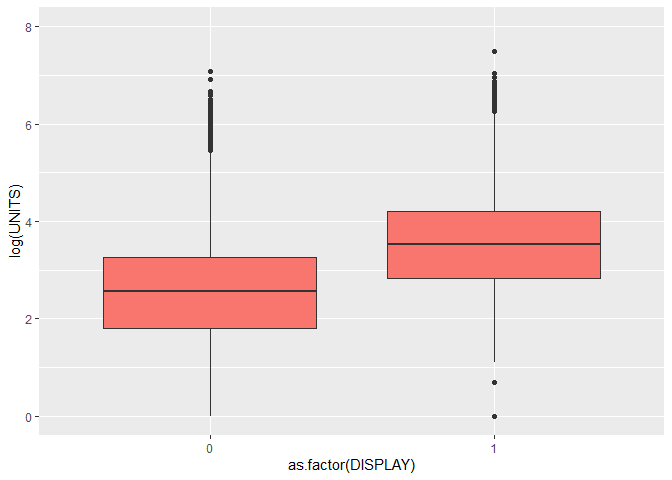<!-- -->

``` r
df %>%
  group_by(TPR_ONLY) %>%
  ggplot()+
  geom_boxplot(aes(x=as.factor(TPR_ONLY),y=log(UNITS),fill="seagreen"))+ylim(0,8)+
  guides(fill=FALSE)
```

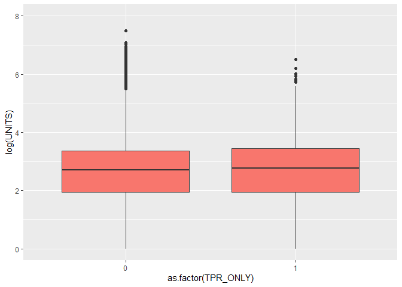<!-- -->

``` r
df2<-aggregate(df$HHS, by=list(Category=df$WEEK_END_DATE), FUN=sum)
```

``` r
ggplot(df2, aes(x=Category, y=x)) +
  geom_line(color="RED3") + ylab("HHS")
```

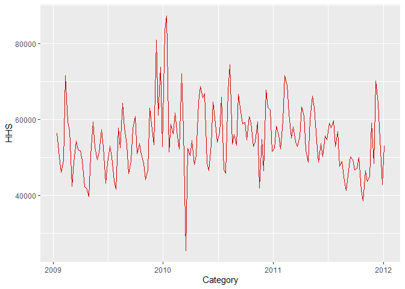<!-- -->

``` r
  xlab("")
```

    ## $x
    ## [1] ""
    ## 
    ## attr(,"class")
    ## [1] "labels"

``` r
ggplot(df, aes(x=df$HHS)) + geom_density(color="purple",fill="purple")+ggtitle("Histogram of HHS")+xlab("HHS")
```

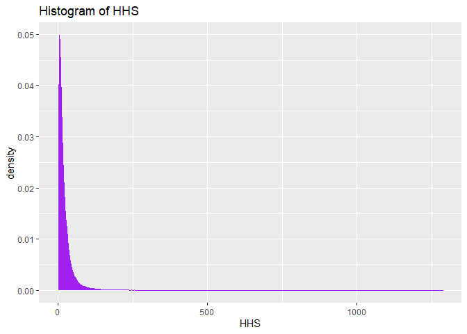<!-- -->

``` r
ggplot(df, aes(x=log(df$HHS))) + geom_density(color="purple",fill="purple")+ggtitle("Histogram of Log HHS")+xlab("Log of HHS")
```

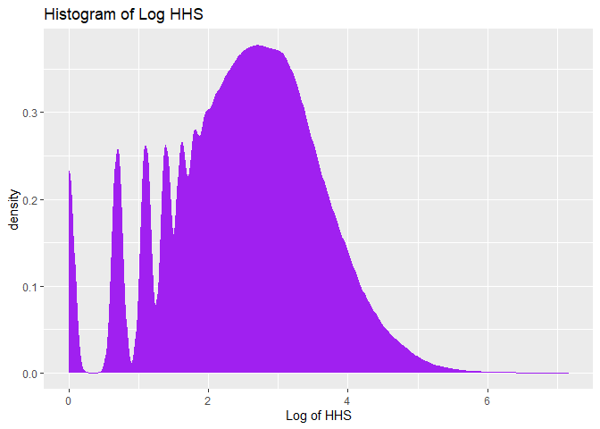<!-- -->

``` r
df %>%
  group_by(week) %>%
  ggplot()+
  geom_boxplot(aes(x=as.factor(week),y=log(HHS),fill="coral"))+ylim(0,8)+
  guides(fill=FALSE)
```

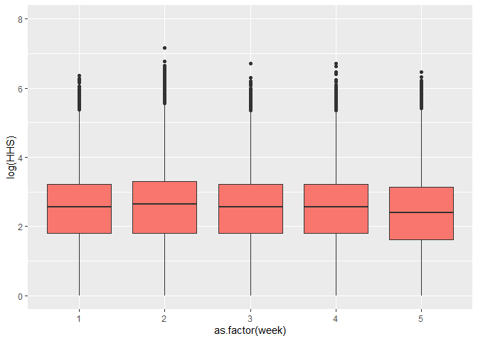<!-- -->

``` r
df %>%
  group_by(month) %>%
  ggplot()+
  geom_boxplot(aes(x=as.factor(month),y=log(HHS),fill="seagreen"))+ylim(0,8)+
  guides(fill=FALSE)
```

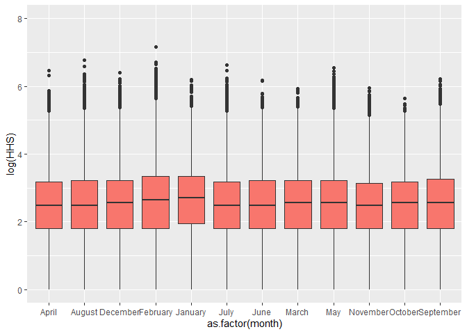<!-- -->

``` r
df %>%
  group_by(year) %>%
  ggplot()+
  geom_boxplot(aes(x=as.factor(year),y=log(HHS),fill="seagreen"))+ylim(0,8)+
  guides(fill=FALSE)
```

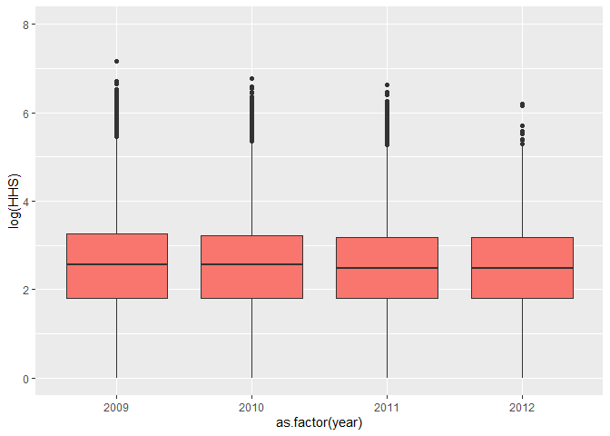<!-- -->

``` r
df %>%
  group_by(STATE) %>%
  ggplot()+
  geom_boxplot(aes(x=as.factor(STATE),y=log(HHS),fill="seagreen"))+ylim(0,8)+
  guides(fill=FALSE)
```

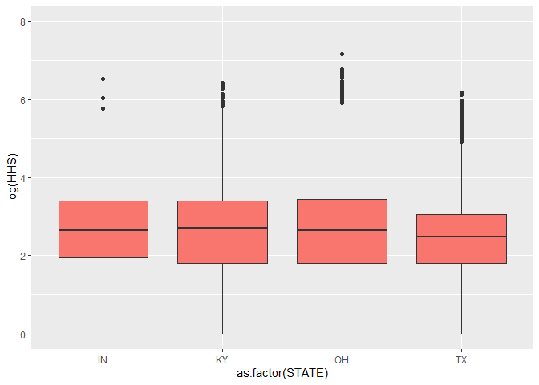<!-- -->

``` r
df %>%
  group_by(SEGMENT) %>%
  ggplot()+
  geom_boxplot(aes(x=as.factor(SEGMENT),y=log(HHS),fill="seagreen"))+ylim(0,8)+
  guides(fill=FALSE)
```

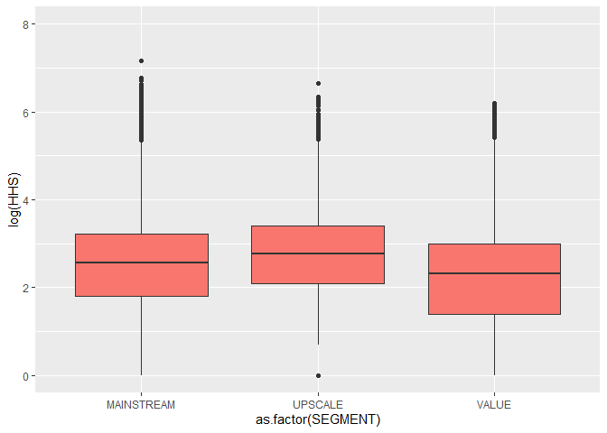<!-- -->

``` r
df %>%
  group_by(MANUFACTURER) %>%
  ggplot()+
  geom_boxplot(aes(x=as.factor(MANUFACTURER),y=log(HHS),fill="seagreen"))+ylim(0,8)+
  guides(fill=FALSE)
```

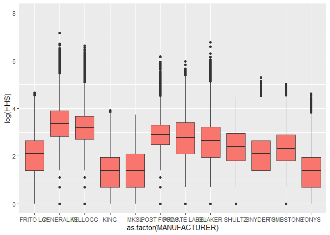<!-- -->

``` r
df %>%
  group_by(FEATURE) %>%
  ggplot()+
  geom_boxplot(aes(x=as.factor(FEATURE),y=log(HHS),fill="seagreen"))+ylim(0,8)+
  guides(fill=FALSE)
```

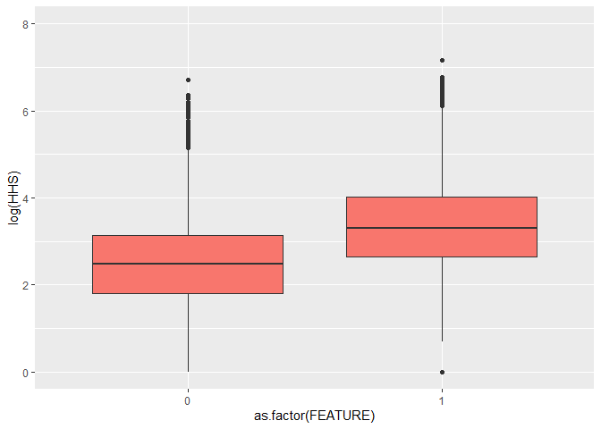<!-- -->

``` r
df %>%
  group_by(DISPLAY) %>%
  ggplot()+
  geom_boxplot(aes(x=as.factor(DISPLAY),y=log(HHS),fill="seagreen"))+ylim(0,8)+
  guides(fill=FALSE)
```

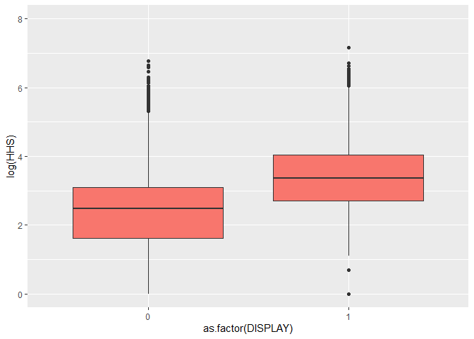<!-- -->

``` r
df %>%
  group_by(TPR_ONLY) %>%
  ggplot()+
  geom_boxplot(aes(x=as.factor(TPR_ONLY),y=log(HHS),fill="seagreen"))+ylim(0,8)+
  guides(fill=FALSE)
```

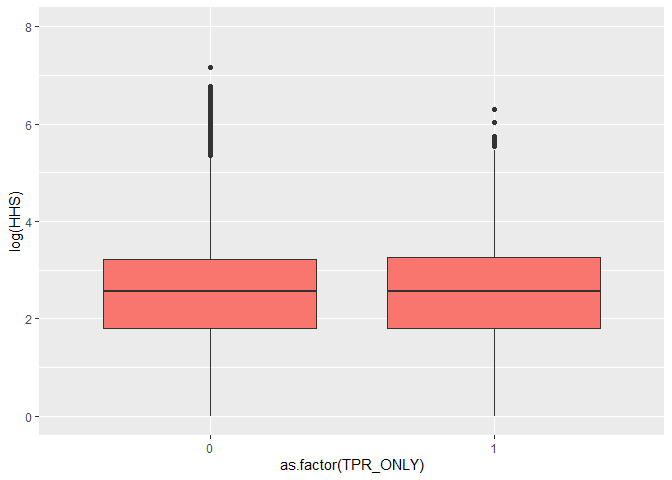<!-- -->

``` r
df %>%
  group_by(CATEGORY) %>%
  ggplot()+
  geom_boxplot(aes(x=as.factor(CATEGORY),y=log(HHS),fill="seagreen"))+ylim(0,8)+
  guides(fill=FALSE)
```

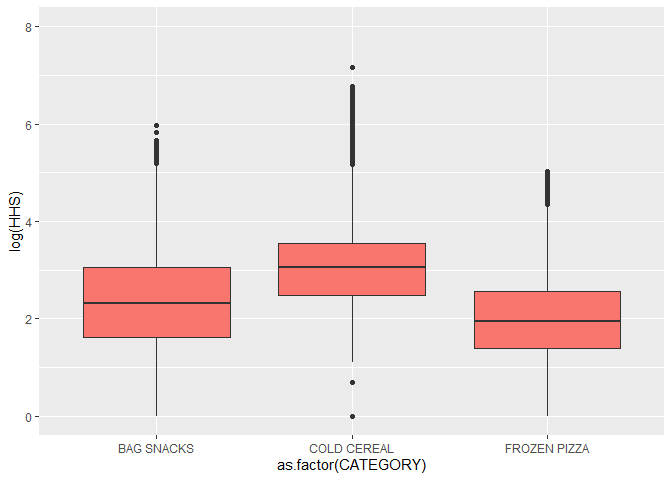<!-- -->

``` r
df2<-aggregate(df$SPEND, by=list(Category=df$WEEK_END_DATE), FUN=sum)
```

``` r
ggplot(df2, aes(x=Category, y=x)) +
  geom_line(color="RED3") + 
  xlab("")
```

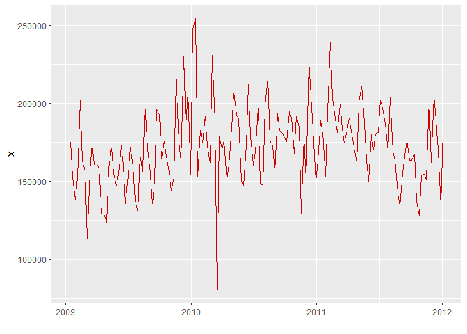<!-- -->

``` r
df$discount<-df$BASE_PRICE-df$PRICE
df$VisitPerH<-df$VISITS/df$HHS
df$VisitSize<-df$UNITS/df$VISITS
df$Product <- paste(df$DESCRIPTION, df$PRODUCT_SIZE, sep="_")
```

Converting to factor and releveling

``` r
df$UPC<-as.factor(df$UPC)
df$Product<-as.factor(df$Product)
df$STORE_NAME<-as.factor(df$STORE_NAME)
df$DESCRIPTION<-as.factor((df$DESCRIPTION))
df$FEATURE<-as.factor(df$FEATURE)
df$TPR_ONLY<-as.factor(df$TPR_ONLY)
df$DISPLAY<-as.factor(df$DISPLAY)
df$MANUFACTURER<-as.factor(df$MANUFACTURER)
df$CATEGORY<-as.factor(df$CATEGORY)
df$STATE<-as.factor(df$STATE)
df$SEGMENT<-as.factor(df$SEGMENT)
df$month<-as.factor(df$month)
df$year<-as.factor(df$year)
df$week<-as.factor(df$week)
df$campaign<-relevel(df$CATEGORY,"COLD CEREAL")
```

``` r
df$SPEND<-as.numeric(df$SPEND)
subset(df, SPEND<0.1)
```

    ##        STORE_NUM        UPC WEEK_END_DATE UNITS VISITS HHS SPEND PRICE
    ## 1944         367 7027316404    2010-06-23     3      3   3  0.00  0.00
    ## 305134     17615 1111087396    2009-09-30     1      1   1  0.01  0.01
    ##        BASE_PRICE FEATURE DISPLAY TPR_ONLY              DESCRIPTION
    ## 1944         1.97       0       0        1    SHURGD PRETZEL STICKS
    ## 305134       3.25       0       0        1 PL SR CRUST 3 MEAT PIZZA
    ##         MANUFACTURER     CATEGORY  SUB_CATEGORY PRODUCT_SIZE
    ## 1944          SHULTZ   BAG SNACKS      PRETZELS        16 OZ
    ## 305134 PRIVATE LABEL FROZEN PIZZA PIZZA/PREMIUM      30.5 OZ
    ##            STORE_NAME       CITY STATE   MSA    SEGMENT  SIZE
    ## 1944   15TH & MADISON  COVINGTON    KY 17140      VALUE 24721
    ## 305134      SUGARLAND SUGAR LAND    TX 26420 MAINSTREAM 48632
    ##        AVG_WEEKLY_BASKETS     month year week discount VisitPerH VisitSize
    ## 1944             12706.53      June 2010    4     1.97         1         1
    ## 305134           32490.86 September 2009    5     3.24         1         1
    ##                                 Product     campaign
    ## 1944        SHURGD PRETZEL STICKS_16 OZ   BAG SNACKS
    ## 305134 PL SR CRUST 3 MEAT PIZZA_30.5 OZ FROZEN PIZZA

``` r
df<-subset(df, SPEND>0.1)
```

``` r
reg<-lmer(formula = log(SPEND)~FEATURE+TPR_ONLY+DISPLAY+year+month+week+SEGMENT+STATE+(1|Product)+CATEGORY+discount+CATEGORY*FEATURE+CATEGORY*DISPLAY+CATEGORY*TPR_ONLY+SEGMENT*FEATURE+SEGMENT*DISPLAY+SEGMENT*TPR_ONLY+(1|STORE_NAME)+PRICE,data=df)
```

``` r
AIC(reg)
```

    ## [1] 820689.3

``` r
vif(reg)
```

    ##                        GVIF Df GVIF^(1/(2*Df))
    ## FEATURE           11.900097  1        3.449652
    ## TPR_ONLY           3.719507  1        1.928602
    ## DISPLAY            3.986846  1        1.996709
    ## year               1.197622  3        1.030513
    ## month              1.280460 11        1.011301
    ## week               1.160940  4        1.018829
    ## SEGMENT            1.063998  2        1.015629
    ## STATE              1.000316  3        1.000053
    ## CATEGORY           1.003845  2        1.000960
    ## discount           4.058885  1        2.014667
    ## PRICE              2.783922  1        1.668509
    ## FEATURE:CATEGORY  17.789106  2        2.053707
    ## DISPLAY:CATEGORY   5.290671  2        1.516623
    ## TPR_ONLY:CATEGORY  3.113391  2        1.328337
    ## FEATURE:SEGMENT    2.880874  2        1.302810
    ## DISPLAY:SEGMENT    2.811369  2        1.294880
    ## TPR_ONLY:SEGMENT   1.815207  2        1.160731

``` r
summary(reg)
```

    ## Linear mixed model fit by REML ['lmerMod']
    ## Formula: 
    ## log(SPEND) ~ FEATURE + TPR_ONLY + DISPLAY + year + month + week +  
    ##     SEGMENT + STATE + (1 | Product) + CATEGORY + discount + CATEGORY *  
    ##     FEATURE + CATEGORY * DISPLAY + CATEGORY * TPR_ONLY + SEGMENT *  
    ##     FEATURE + SEGMENT * DISPLAY + SEGMENT * TPR_ONLY + (1 | STORE_NAME) +  
    ##     PRICE
    ##    Data: df
    ## 
    ## REML criterion at convergence: 820597.3
    ## 
    ## Scaled residuals: 
    ##     Min      1Q  Median      3Q     Max 
    ## -6.9807 -0.5618  0.0818  0.6613  4.6398 
    ## 
    ## Random effects:
    ##  Groups     Name        Variance Std.Dev.
    ##  STORE_NAME (Intercept) 0.09205  0.3034  
    ##  Product    (Intercept) 0.29524  0.5434  
    ##  Residual               0.41473  0.6440  
    ## Number of obs: 418553, groups:  STORE_NAME, 73; Product, 42
    ## 
    ## Fixed effects:
    ##                                 Estimate Std. Error t value
    ## (Intercept)                     3.852916   0.334497  11.519
    ## FEATURE1                        0.112026   0.012296   9.111
    ## TPR_ONLY1                      -0.180212   0.006262 -28.780
    ## DISPLAY1                        0.488532   0.006389  76.467
    ## year2010                       -0.015304   0.002496  -6.131
    ## year2011                       -0.022049   0.002570  -8.580
    ## year2012                       -0.177876   0.013508 -13.168
    ## monthAugust                    -0.029303   0.004940  -5.932
    ## monthDecember                   0.040610   0.004808   8.445
    ## monthFebruary                   0.022033   0.005103   4.318
    ## monthJanuary                    0.047776   0.005204   9.181
    ## monthJuly                      -0.043733   0.004889  -8.945
    ## monthJune                      -0.012935   0.004817  -2.685
    ## monthMarch                     -0.071784   0.004855 -14.786
    ## monthMay                       -0.016037   0.005060  -3.170
    ## monthNovember                  -0.019967   0.004941  -4.041
    ## monthOctober                   -0.028906   0.005083  -5.687
    ## monthSeptember                 -0.028382   0.004839  -5.865
    ## week2                           0.059194   0.003129  18.917
    ## week3                          -0.002844   0.003132  -0.908
    ## week4                          -0.016669   0.003134  -5.319
    ## week5                          -0.074774   0.003932 -19.018
    ## SEGMENTUPSCALE                  0.316566   0.006890  45.944
    ## SEGMENTVALUE                   -0.382800   0.011834 -32.347
    ## STATEKY                         0.011198   0.339352   0.033
    ## STATEOH                        -0.025092   0.308548  -0.081
    ## STATETX                        -0.482528   0.307501  -1.569
    ## CATEGORYCOLD CEREAL             1.275725   0.198441   6.429
    ## CATEGORYFROZEN PIZZA            1.477132   0.210825   7.006
    ## discount                        0.005326   0.004343   1.226
    ## PRICE                          -0.289686   0.003453 -83.900
    ## FEATURE1:CATEGORYCOLD CEREAL    0.328976   0.013405  24.542
    ## FEATURE1:CATEGORYFROZEN PIZZA   0.187827   0.013592  13.819
    ## DISPLAY1:CATEGORYCOLD CEREAL    0.046158   0.008941   5.162
    ## DISPLAY1:CATEGORYFROZEN PIZZA  -0.056797   0.008713  -6.519
    ## TPR_ONLY1:CATEGORYCOLD CEREAL   0.117029   0.007483  15.639
    ## TPR_ONLY1:CATEGORYFROZEN PIZZA  0.120111   0.009193  13.066
    ## FEATURE1:SEGMENTUPSCALE        -0.198053   0.009800 -20.211
    ## FEATURE1:SEGMENTVALUE           0.091255   0.009594   9.512
    ## DISPLAY1:SEGMENTUPSCALE        -0.031328   0.008804  -3.558
    ## DISPLAY1:SEGMENTVALUE           0.045289   0.009256   4.893
    ## TPR_ONLY1:SEGMENTUPSCALE       -0.025738   0.008062  -3.193
    ## TPR_ONLY1:SEGMENTVALUE         -0.126428   0.007705 -16.409

    ## 
    ## Correlation matrix not shown by default, as p = 43 > 12.
    ## Use print(x, correlation=TRUE)  or
    ##     vcov(x)        if you need it

``` r
ranef(reg)
```

    ## $STORE_NAME
    ##                            (Intercept)
    ## 15TH & MADISON       -0.36227204175878
    ## ANDERSON TOWNE CTR    0.56991997692604
    ## ANTOINE TOWN CENTER   0.21391660600309
    ## AT EASTEX FRWY       -0.01655835605503
    ## AT WARD ROAD          0.16095394802972
    ## BEAUMONT             -0.01822321335408
    ## BLUE ASH              0.23754376053082
    ## CARROLLTON            0.09894164457182
    ## CINCINNATI            0.69985707501649
    ## CROWLEY               0.26302937657239
    ## CYPRESS               0.56634108623092
    ## CYPRESS TOWN CENTER  -0.00769041853580
    ## DALLAS                0.23287096115991
    ## DAYTON                0.20992733633257
    ## DEERFIELD TWP        -0.11788100229362
    ## DENT                  0.41736785318155
    ## DENTON                0.31187481013235
    ## DICKINSON VILLAGE    -0.32827470963222
    ## DUNCANVILLE           0.34332891686441
    ## EAST ALLEN            0.41567523174040
    ## FLOWER MOUND          0.14900083632938
    ## FRISCO               -0.29172804033270
    ## GARLAND               0.11738404113436
    ## GOSHEN               -0.07621100270127
    ## HAMILTON              0.18342685412489
    ## HIGHWAY 75           -0.29671076266361
    ## HOUSTON              -0.07691758578078
    ## HYDE PARK             0.31126165064850
    ## INDEPENDENCE         -0.05719755606520
    ## KATY                 -0.21329287747294
    ## KEARNEY               0.08913328688039
    ## KINGWOOD              0.47146230717053
    ## KROGER JUNCTION S/C  -0.14174108655222
    ## LANDEN               -0.29661737631410
    ## LANDMARK PLACE S/C    0.04418048409195
    ## LATONIA               0.08289701064118
    ## LAWRENCEBURG         -0.00000009236457
    ## LEBANON               0.35491926376617
    ## LIBERTY TWP           0.18346049000046
    ## LIBERTY TWP.         -0.05280241044479
    ## LOVELAND             -0.34460177604028
    ## MAGNOLIA              0.17057683856307
    ## MAINEVILLE            0.07449192485061
    ## MCKINNEY             -0.00500894765641
    ## MIAMI TOWNSHIP       -0.18723902246942
    ## MIDDLETOWN            0.11471002254556
    ## MILFORD-MULBERRY     -0.11248049612523
    ## MT. CARMEL           -0.48930578173132
    ## NORTHBOROUGH SQ      -0.17361519190971
    ## NORWOOD              -0.56815270659203
    ## OVER-THE-RHINE       -0.68951058384538
    ## PARKWAY SQUARE S/C   -0.47022358687821
    ## PINEWOOD              0.21070465307826
    ## PLANTATION PLAZA      0.04707175411552
    ## RICHARDSON           -0.13361142616365
    ## ROCKWALL              0.41367138652498
    ## SHERMAN              -0.09849314067799
    ## SILVERLAKE            0.33657258795060
    ## SOUTHLAKE            -0.30269598957591
    ## SPRINGFIELD          -0.21888961420344
    ## ST. MARYS            -0.00176104636863
    ## SUGARLAND            -0.09290266099578
    ## SWEETWATER PLAZA     -0.25555971918494
    ## THE WOODLANDS        -0.17040323548580
    ## TOWN & COUNTRY        0.05270300500943
    ## TYLERSVILLE          -0.00367315974804
    ## VANDALIA              0.13726125485461
    ## WALNUT HILLS/PEEBLES -0.69136848438723
    ## WARSAW AVENUE         0.08270189492047
    ## WHIPP & BIGGER       -0.38407535666309
    ## WOOD FOREST S/C       0.15616134415039
    ## WOODLANDS            -0.60377121556406
    ## WOODLAWN             -0.17383991305039
    ## 
    ## $Product
    ##                                   (Intercept)
    ## DIGIORNO THREE MEAT_29.8 OZ        0.42303039
    ## DIGRN PEPP PIZZA_28.3 OZ           1.06163740
    ## DIGRN SUPREME PIZZA_32.7 OZ        0.75157411
    ## FRSC 4 CHEESE PIZZA_26.11 OZ      -0.21043926
    ## FRSC BRCK OVN ITL PEP PZ_22.7 OZ   0.02775301
    ## FRSC PEPPERONI PIZZA_27.35 OZ     -0.10766653
    ## GM CHEERIOS_12 OZ                  0.38523359
    ## GM CHEERIOS_18 OZ                  0.89247242
    ## GM HONEY NUT CHEERIOS_12.25 OZ     0.79676779
    ## KELL BITE SIZE MINI WHEAT_18 OZ    0.40439083
    ## KELL FROOT LOOPS_12.2 OZ           0.05567016
    ## KELL FROSTED FLAKES_15 OZ          0.45442881
    ## MKSL DUTCH PRETZELS_16 OZ         -0.82708273
    ## MKSL MINI TWIST PRETZELS_16 OZ    -0.74610089
    ## MKSL PRETZEL STICKS_16 OZ         -1.05044348
    ## NWMN OWN 4 CHEESE PIZZA_13.3 OZ   -0.17276676
    ## NWMN OWN PEPPERONI PIZZA_13.2 OZ  -0.07374148
    ## NWMN OWN SUPREME PIZZA_14.7 OZ    -0.21032810
    ## PL BT SZ FRSTD SHRD WHT_18 OZ     -0.13162840
    ## PL HONEY NUT TOASTD OATS_12.25 OZ -0.96860660
    ## PL MINI TWIST PRETZELS_15 OZ       0.65681434
    ## PL PRETZEL STICKS_15 OZ            0.49519828
    ## PL RAISIN BRAN_20 OZ              -0.50526858
    ## PL SR CRUST 3 MEAT PIZZA_30.5 OZ  -0.56821517
    ## PL SR CRUST PEPPRN PIZZA_29.6 OZ  -0.33749477
    ## PL SR CRUST SUPRM PIZZA_32.7 OZ   -0.58334290
    ## PL TWIST PRETZELS_15 OZ           -0.24068022
    ## POST FM SZ HNYBNCH OT ALM_18 OZ    0.29616167
    ## POST FRUITY PEBBLES_11 OZ         -0.27614659
    ## POST HNY BN OTS HNY RSTD_18 OZ     0.41564213
    ## QKER CAP N CRUNCH BERRIES_13 OZ   -0.15432080
    ## QKER CAP N CRUNCH_14 OZ           -0.68046753
    ## QKER LIFE ORIGINAL_13 OZ          -0.98432898
    ## RLDGLD BRAIDED HONEY WHT_10 OZ     0.02249549
    ## RLDGLD PRETZEL STICKS_16 OZ        0.29365569
    ## RLDGLD TINY TWISTS PRTZL_16 OZ     0.58204305
    ## SHURGD MINI PRETZELS_16 OZ         0.15768294
    ## SHURGD PRETZEL RODS_12 OZ         -0.05289629
    ## SHURGD PRETZEL STICKS_16 OZ        0.20862209
    ## SNYDR FF MINI PRETZELS_16 OZ       0.32682086
    ## SNYDR PRETZEL RODS_10 OZ          -0.10465492
    ## SNYDR SOURDOUGH NIBBLERS_16 OZ     0.27852536
    ## 
    ## with conditional variances for "STORE_NAME" "Product"

``` r
plot(df$SPEND,df$discount)
```

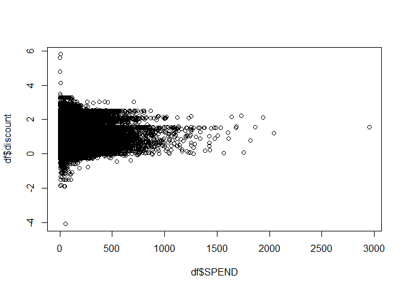<!-- -->

``` r
reg2<-lmer(formula = log(HHS)~FEATURE+TPR_ONLY+DISPLAY+year+month+week+SEGMENT+STATE+(1|Product)+CATEGORY+discount+CATEGORY*FEATURE+CATEGORY*DISPLAY+CATEGORY*TPR_ONLY+(1|STORE_NAME)+SEGMENT*FEATURE+SEGMENT*DISPLAY+SEGMENT*TPR_ONLY+PRICE,data=df)
```

``` r
AIC(reg2)
```

    ## [1] 784006.7

``` r
vif(reg2)
```

    ##                        GVIF Df GVIF^(1/(2*Df))
    ## FEATURE           11.900090  1        3.449651
    ## TPR_ONLY           3.719510  1        1.928603
    ## DISPLAY            3.986846  1        1.996709
    ## year               1.197625  3        1.030513
    ## month              1.280461 11        1.011301
    ## week               1.160940  4        1.018829
    ## SEGMENT            1.063914  2        1.015609
    ## STATE              1.000279  3        1.000046
    ## CATEGORY           1.003578  2        1.000893
    ## discount           4.058994  1        2.014694
    ## PRICE              2.783839  1        1.668484
    ## FEATURE:CATEGORY  17.789076  2        2.053706
    ## DISPLAY:CATEGORY   5.290667  2        1.516623
    ## TPR_ONLY:CATEGORY  3.113392  2        1.328338
    ## FEATURE:SEGMENT    2.880835  2        1.302806
    ## DISPLAY:SEGMENT    2.811334  2        1.294876
    ## TPR_ONLY:SEGMENT   1.815176  2        1.160726

``` r
summary(reg2)
```

    ## Linear mixed model fit by REML ['lmerMod']
    ## Formula: log(HHS) ~ FEATURE + TPR_ONLY + DISPLAY + year + month + week +  
    ##     SEGMENT + STATE + (1 | Product) + CATEGORY + discount + CATEGORY *  
    ##     FEATURE + CATEGORY * DISPLAY + CATEGORY * TPR_ONLY + (1 |  
    ##     STORE_NAME) + SEGMENT * FEATURE + SEGMENT * DISPLAY + SEGMENT *  
    ##     TPR_ONLY + PRICE
    ##    Data: df
    ## 
    ## REML criterion at convergence: 783914.7
    ## 
    ## Scaled residuals: 
    ##     Min      1Q  Median      3Q     Max 
    ## -6.9985 -0.5596  0.0813  0.6566  4.2936 
    ## 
    ## Random effects:
    ##  Groups     Name        Variance Std.Dev.
    ##  STORE_NAME (Intercept) 0.09557  0.3091  
    ##  Product    (Intercept) 0.29068  0.5392  
    ##  Residual               0.37992  0.6164  
    ## Number of obs: 418553, groups:  STORE_NAME, 73; Product, 42
    ## 
    ## Fixed effects:
    ##                                 Estimate Std. Error  t value
    ## (Intercept)                     3.417430   0.339249   10.074
    ## FEATURE1                        0.215424   0.011768   18.306
    ## TPR_ONLY1                      -0.121881   0.005993  -20.337
    ## DISPLAY1                        0.495173   0.006115   80.980
    ## year2010                       -0.015642   0.002389   -6.547
    ## year2011                       -0.020703   0.002459   -8.418
    ## year2012                       -0.188538   0.012928  -14.583
    ## monthAugust                    -0.021423   0.004728   -4.531
    ## monthDecember                   0.038821   0.004602    8.435
    ## monthFebruary                   0.029108   0.004884    5.960
    ## monthJanuary                    0.057626   0.004981   11.570
    ## monthJuly                      -0.041203   0.004680   -8.805
    ## monthJune                      -0.011824   0.004611   -2.565
    ## monthMarch                     -0.072093   0.004647  -15.515
    ## monthMay                       -0.012594   0.004843   -2.601
    ## monthNovember                  -0.025234   0.004729   -5.336
    ## monthOctober                   -0.033107   0.004865   -6.805
    ## monthSeptember                 -0.024739   0.004632   -5.341
    ## week2                           0.062836   0.002995   20.980
    ## week3                           0.004860   0.002998    1.621
    ## week4                          -0.010148   0.002999   -3.383
    ## week5                          -0.065410   0.003763  -17.381
    ## SEGMENTUPSCALE                  0.311458   0.006597   47.213
    ## SEGMENTVALUE                   -0.407327   0.011340  -35.920
    ## STATEKY                        -0.014131   0.345759   -0.041
    ## STATEOH                        -0.042677   0.314373   -0.136
    ## STATETX                        -0.467552   0.313306   -1.492
    ## CATEGORYCOLD CEREAL             1.196145   0.196902    6.075
    ## CATEGORYFROZEN PIZZA            1.313287   0.209167    6.279
    ## discount                        0.014891   0.004157    3.583
    ## PRICE                          -0.507289   0.003305 -153.501
    ## FEATURE1:CATEGORYCOLD CEREAL    0.205550   0.012830   16.021
    ## FEATURE1:CATEGORYFROZEN PIZZA  -0.016141   0.013009   -1.241
    ## DISPLAY1:CATEGORYCOLD CEREAL    0.051532   0.008558    6.022
    ## DISPLAY1:CATEGORYFROZEN PIZZA  -0.096109   0.008339  -11.525
    ## TPR_ONLY1:CATEGORYCOLD CEREAL   0.097199   0.007162   13.571
    ## TPR_ONLY1:CATEGORYFROZEN PIZZA  0.004115   0.008799    0.468
    ## FEATURE1:SEGMENTUPSCALE        -0.199088   0.009379  -21.227
    ## FEATURE1:SEGMENTVALUE           0.122116   0.009182   13.299
    ## DISPLAY1:SEGMENTUPSCALE        -0.031708   0.008427   -3.763
    ## DISPLAY1:SEGMENTVALUE           0.066980   0.008859    7.560
    ## TPR_ONLY1:SEGMENTUPSCALE       -0.035170   0.007716   -4.558
    ## TPR_ONLY1:SEGMENTVALUE         -0.079745   0.007374  -10.814

    ## 
    ## Correlation matrix not shown by default, as p = 43 > 12.
    ## Use print(x, correlation=TRUE)  or
    ##     vcov(x)        if you need it

``` r
ranef(reg2)
```

    ## $STORE_NAME
    ##                           (Intercept)
    ## 15TH & MADISON       -0.4052926995468
    ## ANDERSON TOWNE CTR    0.5833705289846
    ## ANTOINE TOWN CENTER   0.2131297465663
    ## AT EASTEX FRWY       -0.0234703901733
    ## AT WARD ROAD          0.1735761524372
    ## BEAUMONT             -0.0378621008970
    ## BLUE ASH              0.2503973886486
    ## CARROLLTON            0.0952013301142
    ## CINCINNATI            0.7055768716306
    ## CROWLEY               0.2601645774490
    ## CYPRESS               0.5664324308482
    ## CYPRESS TOWN CENTER   0.0100684891924
    ## DALLAS                0.2467471675715
    ## DAYTON                0.1875312452390
    ## DEERFIELD TWP        -0.1008589242725
    ## DENT                  0.4375403449710
    ## DENTON                0.3044331144401
    ## DICKINSON VILLAGE    -0.3162833602700
    ## DUNCANVILLE           0.3378866491113
    ## EAST ALLEN            0.4047385619325
    ## FLOWER MOUND          0.1514201070667
    ## FRISCO               -0.2759728973243
    ## GARLAND               0.1099883902542
    ## GOSHEN               -0.0524783086490
    ## HAMILTON              0.1429621920995
    ## HIGHWAY 75           -0.3255527604517
    ## HOUSTON              -0.0741842442705
    ## HYDE PARK             0.3348554222951
    ## INDEPENDENCE         -0.0293302861574
    ## KATY                 -0.2103462053464
    ## KEARNEY               0.0960332000176
    ## KINGWOOD              0.4787560391341
    ## KROGER JUNCTION S/C  -0.1314631489637
    ## LANDEN               -0.2722012401052
    ## LANDMARK PLACE S/C    0.0247015870681
    ## LATONIA               0.0868029172903
    ## LAWRENCEBURG          0.0000000946771
    ## LEBANON               0.3711026523265
    ## LIBERTY TWP           0.1974087682149
    ## LIBERTY TWP.         -0.0580582210155
    ## LOVELAND             -0.3281111915855
    ## MAGNOLIA              0.1770908330292
    ## MAINEVILLE            0.0916085385788
    ## MCKINNEY             -0.0012740664256
    ## MIAMI TOWNSHIP       -0.1698217777668
    ## MIDDLETOWN            0.1272975114176
    ## MILFORD-MULBERRY     -0.1017852985485
    ## MT. CARMEL           -0.4734383564044
    ## NORTHBOROUGH SQ      -0.2048938881884
    ## NORWOOD              -0.5557779980531
    ## OVER-THE-RHINE       -0.7869276082072
    ## PARKWAY SQUARE S/C   -0.4741087896359
    ## PINEWOOD              0.1779643624869
    ## PLANTATION PLAZA      0.0490454502139
    ## RICHARDSON           -0.1307123632851
    ## ROCKWALL              0.3998343325323
    ## SHERMAN              -0.1174699894597
    ## SILVERLAKE            0.3478200699583
    ## SOUTHLAKE            -0.3122008848242
    ## SPRINGFIELD          -0.2181921170302
    ## ST. MARYS            -0.0073185298174
    ## SUGARLAND            -0.0876641175875
    ## SWEETWATER PLAZA     -0.2466422229976
    ## THE WOODLANDS        -0.1650653906325
    ## TOWN & COUNTRY        0.0772251435693
    ## TYLERSVILLE           0.0074596790188
    ## VANDALIA              0.1518928801394
    ## WALNUT HILLS/PEEBLES -0.7583858026881
    ## WARSAW AVENUE         0.0406603902300
    ## WHIPP & BIGGER       -0.3740477129804
    ## WOOD FOREST S/C       0.1740165233546
    ## WOODLANDS            -0.5823200268980
    ## WOODLAWN             -0.1832289203554
    ## 
    ## $Product
    ##                                   (Intercept)
    ## DIGIORNO THREE MEAT_29.8 OZ        0.47890553
    ## DIGRN PEPP PIZZA_28.3 OZ           1.07246199
    ## DIGRN SUPREME PIZZA_32.7 OZ        0.81273721
    ## FRSC 4 CHEESE PIZZA_26.11 OZ      -0.15532232
    ## FRSC BRCK OVN ITL PEP PZ_22.7 OZ   0.08436317
    ## FRSC PEPPERONI PIZZA_27.35 OZ     -0.05177108
    ## GM CHEERIOS_12 OZ                  0.36681388
    ## GM CHEERIOS_18 OZ                  0.71397874
    ## GM HONEY NUT CHEERIOS_12.25 OZ     0.80159940
    ## KELL BITE SIZE MINI WHEAT_18 OZ    0.27526281
    ## KELL FROOT LOOPS_12.2 OZ           0.08915105
    ## KELL FROSTED FLAKES_15 OZ          0.48488489
    ## MKSL DUTCH PRETZELS_16 OZ         -0.82435137
    ## MKSL MINI TWIST PRETZELS_16 OZ    -0.70438404
    ## MKSL PRETZEL STICKS_16 OZ         -0.99984470
    ## NWMN OWN 4 CHEESE PIZZA_13.3 OZ   -0.19594387
    ## NWMN OWN PEPPERONI PIZZA_13.2 OZ  -0.09495927
    ## NWMN OWN SUPREME PIZZA_14.7 OZ    -0.18812279
    ## PL BT SZ FRSTD SHRD WHT_18 OZ     -0.06524295
    ## PL HONEY NUT TOASTD OATS_12.25 OZ -0.77010339
    ## PL MINI TWIST PRETZELS_15 OZ       0.94940668
    ## PL PRETZEL STICKS_15 OZ            0.81122825
    ## PL RAISIN BRAN_20 OZ              -0.37984923
    ## PL SR CRUST 3 MEAT PIZZA_30.5 OZ  -0.65711598
    ## PL SR CRUST PEPPRN PIZZA_29.6 OZ  -0.45807516
    ## PL SR CRUST SUPRM PIZZA_32.7 OZ   -0.64715743
    ## PL TWIST PRETZELS_15 OZ            0.08827346
    ## POST FM SZ HNYBNCH OT ALM_18 OZ    0.13592145
    ## POST FRUITY PEBBLES_11 OZ         -0.20283192
    ## POST HNY BN OTS HNY RSTD_18 OZ     0.22364195
    ## QKER CAP N CRUNCH BERRIES_13 OZ   -0.08198411
    ## QKER CAP N CRUNCH_14 OZ           -0.58440350
    ## QKER LIFE ORIGINAL_13 OZ          -1.00683931
    ## RLDGLD BRAIDED HONEY WHT_10 OZ    -0.08472395
    ## RLDGLD PRETZEL STICKS_16 OZ        0.23943031
    ## RLDGLD TINY TWISTS PRTZL_16 OZ     0.52589028
    ## SHURGD MINI PRETZELS_16 OZ        -0.01810936
    ## SHURGD PRETZEL RODS_12 OZ         -0.28942467
    ## SHURGD PRETZEL STICKS_16 OZ        0.06003633
    ## SNYDR FF MINI PRETZELS_16 OZ       0.25674959
    ## SNYDR PRETZEL RODS_10 OZ          -0.17693832
    ## SNYDR SOURDOUGH NIBBLERS_16 OZ     0.16676143
    ## 
    ## with conditional variances for "STORE_NAME" "Product"

``` r
reg3<-lmer(formula = log(UNITS)~FEATURE+TPR_ONLY+DISPLAY+year+month+week+SEGMENT+STATE+(1|Product)+CATEGORY+discount+CATEGORY*FEATURE+CATEGORY*DISPLAY+CATEGORY*TPR_ONLY+(1|STORE_NAME)+SEGMENT*FEATURE+SEGMENT*DISPLAY+SEGMENT*TPR_ONLY+HHS+PRICE,data=df)
```

``` r
AIC(reg3)
```

    ## [1] 693267.7

``` r
vif(reg3)
```

    ##                        GVIF Df GVIF^(1/(2*Df))
    ## FEATURE           11.903720  1        3.450177
    ## TPR_ONLY           3.723293  1        1.929584
    ## DISPLAY            4.038376  1        2.009571
    ## year               1.197876  3        1.030549
    ## month              1.284535 11        1.011447
    ## week               1.163466  4        1.019106
    ## SEGMENT            1.067402  2        1.016441
    ## STATE              1.000741  3        1.000123
    ## CATEGORY           1.005366  2        1.001339
    ## discount           4.080532  1        2.020033
    ## HHS                1.462770  1        1.209450
    ## PRICE              2.812969  1        1.677191
    ## FEATURE:CATEGORY  18.516499  2        2.074387
    ## DISPLAY:CATEGORY   5.402341  2        1.524563
    ## TPR_ONLY:CATEGORY  3.125164  2        1.329591
    ## FEATURE:SEGMENT    2.882341  2        1.302976
    ## DISPLAY:SEGMENT    2.812805  2        1.295045
    ## TPR_ONLY:SEGMENT   1.815783  2        1.160823

``` r
summary(reg3)
```

    ## Linear mixed model fit by REML ['lmerMod']
    ## Formula: 
    ## log(UNITS) ~ FEATURE + TPR_ONLY + DISPLAY + year + month + week +  
    ##     SEGMENT + STATE + (1 | Product) + CATEGORY + discount + CATEGORY *  
    ##     FEATURE + CATEGORY * DISPLAY + CATEGORY * TPR_ONLY + (1 |  
    ##     STORE_NAME) + SEGMENT * FEATURE + SEGMENT * DISPLAY + SEGMENT *  
    ##     TPR_ONLY + HHS + PRICE
    ##    Data: df
    ## 
    ## REML criterion at convergence: 693173.7
    ## 
    ## Scaled residuals: 
    ##     Min      1Q  Median      3Q     Max 
    ## -36.824  -0.451   0.127   0.630   5.807 
    ## 
    ## Random effects:
    ##  Groups     Name        Variance Std.Dev.
    ##  STORE_NAME (Intercept) 0.03557  0.1886  
    ##  Product    (Intercept) 0.15713  0.3964  
    ##  Residual               0.30590  0.5531  
    ## Number of obs: 418553, groups:  STORE_NAME, 73; Product, 42
    ## 
    ## Fixed effects:
    ##                                   Estimate  Std. Error  t value
    ## (Intercept)                     3.11328545  0.21486076   14.490
    ## FEATURE1                        0.15563009  0.01056137   14.736
    ## TPR_ONLY1                      -0.03297304  0.00538037   -6.128
    ## DISPLAY1                        0.26544452  0.00552215   48.069
    ## year2010                       -0.01997704  0.00214386   -9.318
    ## year2011                       -0.02097690  0.00220691   -9.505
    ## year2012                       -0.14960093  0.01160129  -12.895
    ## monthAugust                    -0.03729888  0.00424253   -8.792
    ## monthDecember                   0.01322617  0.00413049    3.202
    ## monthFebruary                  -0.00123868  0.00438312   -0.283
    ## monthJanuary                    0.01758572  0.00447029    3.934
    ## monthJuly                      -0.03768694  0.00419922   -8.975
    ## monthJune                      -0.01704148  0.00413722   -4.119
    ## monthMarch                     -0.05541939  0.00416992  -13.290
    ## monthMay                       -0.02648246  0.00434555   -6.094
    ## monthNovember                  -0.00897372  0.00424394   -2.114
    ## monthOctober                   -0.01641223  0.00436565   -3.759
    ## monthSeptember                 -0.02458125  0.00415611   -5.914
    ## week2                           0.03250093  0.00268838   12.089
    ## week3                           0.00064912  0.00268982    0.241
    ## week4                          -0.00922331  0.00269144   -3.427
    ## week5                          -0.05185008  0.00337724  -15.353
    ## SEGMENTUPSCALE                  0.22610249  0.00590845   38.268
    ## SEGMENTVALUE                   -0.27037663  0.01007853  -26.827
    ## STATEKY                        -0.01270440  0.21103993   -0.060
    ## STATEOH                        -0.04607291  0.19188602   -0.240
    ## STATETX                        -0.28371359  0.19123733   -1.484
    ## CATEGORYCOLD CEREAL             0.87472871  0.14477915    6.042
    ## CATEGORYFROZEN PIZZA            1.11118358  0.15391156    7.220
    ## discount                       -0.10172492  0.00373956  -27.202
    ## HHS                             0.01880047  0.00004948  379.966
    ## PRICE                          -0.43065955  0.00297982 -144.525
    ## FEATURE1:CATEGORYCOLD CEREAL   -0.19489878  0.01158034  -16.830
    ## FEATURE1:CATEGORYFROZEN PIZZA   0.11007073  0.01167748    9.426
    ## DISPLAY1:CATEGORYCOLD CEREAL   -0.18527218  0.00771108  -24.027
    ## DISPLAY1:CATEGORYFROZEN PIZZA   0.07836764  0.00749659   10.454
    ## TPR_ONLY1:CATEGORYCOLD CEREAL   0.02943955  0.00642976    4.579
    ## TPR_ONLY1:CATEGORYFROZEN PIZZA  0.08030299  0.00789995   10.165
    ## FEATURE1:SEGMENTUPSCALE        -0.13346026  0.00841774  -15.855
    ## FEATURE1:SEGMENTVALUE           0.10241856  0.00823926   12.431
    ## DISPLAY1:SEGMENTUPSCALE        -0.03307107  0.00756138   -4.374
    ## DISPLAY1:SEGMENTVALUE           0.10141614  0.00795109   12.755
    ## TPR_ONLY1:SEGMENTUPSCALE       -0.03524528  0.00692379   -5.090
    ## TPR_ONLY1:SEGMENTVALUE         -0.09398392  0.00661731  -14.203

    ## 
    ## Correlation matrix not shown by default, as p = 44 > 12.
    ## Use print(x, correlation=TRUE)  or
    ##     vcov(x)        if you need it

``` r
ranef(reg3)
```

    ## $STORE_NAME
    ##                            (Intercept)
    ## 15TH & MADISON       -0.20709560561883
    ## ANDERSON TOWNE CTR    0.21755587698681
    ## ANTOINE TOWN CENTER   0.09907008343329
    ## AT EASTEX FRWY       -0.05592053555159
    ## AT WARD ROAD          0.11547688497231
    ## BEAUMONT              0.00461520945329
    ## BLUE ASH              0.10966192333077
    ## CARROLLTON            0.08543844855241
    ## CINCINNATI            0.28937439079026
    ## CROWLEY               0.18819973835076
    ## CYPRESS               0.38547270275462
    ## CYPRESS TOWN CENTER   0.01821284586428
    ## DALLAS                0.16973434266424
    ## DAYTON                0.11000384072485
    ## DEERFIELD TWP        -0.06263586287471
    ## DENT                  0.20042639829675
    ## DENTON                0.23583472585842
    ## DICKINSON VILLAGE    -0.22966780638670
    ## DUNCANVILLE           0.17053147396966
    ## EAST ALLEN            0.29475617534612
    ## FLOWER MOUND          0.13228261618778
    ## FRISCO               -0.19176311495395
    ## GARLAND               0.05122769426891
    ## GOSHEN               -0.01012334161474
    ## HAMILTON              0.13410282509927
    ## HIGHWAY 75           -0.20605458536985
    ## HOUSTON              -0.06127584337209
    ## HYDE PARK             0.13361762872307
    ## INDEPENDENCE         -0.02312797347297
    ## KATY                 -0.12495894032817
    ## KEARNEY               0.05538699294414
    ## KINGWOOD              0.34225308018472
    ## KROGER JUNCTION S/C  -0.12289961208844
    ## LANDEN               -0.14778082460700
    ## LANDMARK PLACE S/C    0.03126448147756
    ## LATONIA               0.03291605353741
    ## LAWRENCEBURG          0.00000004318441
    ## LEBANON               0.20495959915094
    ## LIBERTY TWP           0.10062213818092
    ## LIBERTY TWP.          0.00876829355055
    ## LOVELAND             -0.16229695136459
    ## MAGNOLIA              0.14222781996650
    ## MAINEVILLE            0.07412528207049
    ## MCKINNEY             -0.00059175707527
    ## MIAMI TOWNSHIP       -0.07816841978164
    ## MIDDLETOWN            0.07740718562539
    ## MILFORD-MULBERRY     -0.02121688863682
    ## MT. CARMEL           -0.28487095200133
    ## NORTHBOROUGH SQ      -0.15807852530958
    ## NORWOOD              -0.41232702601562
    ## OVER-THE-RHINE       -0.45228612362352
    ## PARKWAY SQUARE S/C   -0.33206894553924
    ## PINEWOOD              0.19479583143761
    ## PLANTATION PLAZA      0.05062569606503
    ## RICHARDSON           -0.07125698095813
    ## ROCKWALL              0.28994008753031
    ## SHERMAN              -0.05450996970889
    ## SILVERLAKE            0.19730752708927
    ## SOUTHLAKE            -0.18492468523751
    ## SPRINGFIELD          -0.12045047973611
    ## ST. MARYS            -0.01587833826339
    ## SUGARLAND            -0.04538493620451
    ## SWEETWATER PLAZA     -0.17015042415988
    ## THE WOODLANDS        -0.08576663770533
    ## TOWN & COUNTRY        0.05022892773455
    ## TYLERSVILLE           0.03412700362185
    ## VANDALIA              0.09531120227667
    ## WALNUT HILLS/PEEBLES -0.46249319485775
    ## WARSAW AVENUE         0.05740613859327
    ## WHIPP & BIGGER       -0.20069463477302
    ## WOOD FOREST S/C       0.06330685191923
    ## WOODLANDS            -0.41825769310610
    ## WOODLAWN             -0.07359850795942
    ## 
    ## $Product
    ##                                   (Intercept)
    ## DIGIORNO THREE MEAT_29.8 OZ        0.37223552
    ## DIGRN PEPP PIZZA_28.3 OZ           0.85964302
    ## DIGRN SUPREME PIZZA_32.7 OZ        0.63071218
    ## FRSC 4 CHEESE PIZZA_26.11 OZ      -0.14269169
    ## FRSC BRCK OVN ITL PEP PZ_22.7 OZ   0.04593606
    ## FRSC PEPPERONI PIZZA_27.35 OZ     -0.07064288
    ## GM CHEERIOS_12 OZ                  0.21613055
    ## GM CHEERIOS_18 OZ                  0.71344044
    ## GM HONEY NUT CHEERIOS_12.25 OZ     0.24554015
    ## KELL BITE SIZE MINI WHEAT_18 OZ    0.31060342
    ## KELL FROOT LOOPS_12.2 OZ          -0.03316672
    ## KELL FROSTED FLAKES_15 OZ          0.17558178
    ## MKSL DUTCH PRETZELS_16 OZ         -0.63900488
    ## MKSL MINI TWIST PRETZELS_16 OZ    -0.57817362
    ## MKSL PRETZEL STICKS_16 OZ         -0.85047606
    ## NWMN OWN 4 CHEESE PIZZA_13.3 OZ   -0.11943392
    ## NWMN OWN PEPPERONI PIZZA_13.2 OZ  -0.06099577
    ## NWMN OWN SUPREME PIZZA_14.7 OZ    -0.23042735
    ## PL BT SZ FRSTD SHRD WHT_18 OZ     -0.12869572
    ## PL HONEY NUT TOASTD OATS_12.25 OZ -0.57100240
    ## PL MINI TWIST PRETZELS_15 OZ       0.39895519
    ## PL PRETZEL STICKS_15 OZ            0.38629251
    ## PL RAISIN BRAN_20 OZ              -0.22087172
    ## PL SR CRUST 3 MEAT PIZZA_30.5 OZ  -0.48732151
    ## PL SR CRUST PEPPRN PIZZA_29.6 OZ  -0.29580399
    ## PL SR CRUST SUPRM PIZZA_32.7 OZ   -0.50120973
    ## PL TWIST PRETZELS_15 OZ           -0.01293726
    ## POST FM SZ HNYBNCH OT ALM_18 OZ    0.27645864
    ## POST FRUITY PEBBLES_11 OZ         -0.17281013
    ## POST HNY BN OTS HNY RSTD_18 OZ     0.36273308
    ## QKER CAP N CRUNCH BERRIES_13 OZ   -0.09350813
    ## QKER CAP N CRUNCH_14 OZ           -0.44172287
    ## QKER LIFE ORIGINAL_13 OZ          -0.63871051
    ## RLDGLD BRAIDED HONEY WHT_10 OZ    -0.08245284
    ## RLDGLD PRETZEL STICKS_16 OZ        0.11980856
    ## RLDGLD TINY TWISTS PRTZL_16 OZ     0.34382438
    ## SHURGD MINI PRETZELS_16 OZ         0.29890344
    ## SHURGD PRETZEL RODS_12 OZ          0.14219220
    ## SHURGD PRETZEL STICKS_16 OZ        0.33690924
    ## SNYDR FF MINI PRETZELS_16 OZ       0.15565085
    ## SNYDR PRETZEL RODS_10 OZ          -0.13085251
    ## SNYDR SOURDOUGH NIBBLERS_16 OZ     0.11136069
    ## 
    ## with conditional variances for "STORE_NAME" "Product"

``` r
#product_summary <- df %>% 
 # group_by(year, Product) %>%
  #summarise(UNITS = mean(UNITS), 
   #         SPEND = sum(SPEND), 
    #        PRICE = mean(PRICE), 
     #       BASE_PRICE = mean(BASE_PRICE)) %>%
#  arrange(year,Product)

#glimpse(product_summary)
```

``` r
stargazer(reg,reg2,reg3,type="text",title='Results',align = TRUE,single.row=TRUE,digits=2,out = "reg3.txt")
```

    ## 
    ## Results
    ## =================================================================================
    ##                                               Dependent variable:                
    ##                                --------------------------------------------------
    ##                                   log(SPEND)        log(HHS)        log(UNITS)   
    ##                                      (1)              (2)              (3)       
    ## ---------------------------------------------------------------------------------
    ## FEATURE1                        0.11*** (0.01)   0.22*** (0.01)   0.16*** (0.01) 
    ## TPR_ONLY1                      -0.18*** (0.01)  -0.12*** (0.01)  -0.03*** (0.01) 
    ## DISPLAY1                        0.49*** (0.01)   0.50*** (0.01)   0.27*** (0.01) 
    ## year2010                       -0.02*** (0.002) -0.02*** (0.002) -0.02*** (0.002)
    ## year2011                       -0.02*** (0.003) -0.02*** (0.002) -0.02*** (0.002)
    ## year2012                       -0.18*** (0.01)  -0.19*** (0.01)  -0.15*** (0.01) 
    ## monthAugust                    -0.03*** (0.005) -0.02*** (0.005) -0.04*** (0.004)
    ## monthDecember                  0.04*** (0.005)  0.04*** (0.005)  0.01*** (0.004) 
    ## monthFebruary                   0.02*** (0.01)  0.03*** (0.005)   -0.001 (0.004) 
    ## monthJanuary                    0.05*** (0.01)  0.06*** (0.005)  0.02*** (0.004) 
    ## monthJuly                      -0.04*** (0.005) -0.04*** (0.005) -0.04*** (0.004)
    ## monthJune                      -0.01*** (0.005) -0.01** (0.005)  -0.02*** (0.004)
    ## monthMarch                     -0.07*** (0.005) -0.07*** (0.005) -0.06*** (0.004)
    ## monthMay                       -0.02*** (0.01)  -0.01*** (0.005) -0.03*** (0.004)
    ## monthNovember                  -0.02*** (0.005) -0.03*** (0.005) -0.01** (0.004) 
    ## monthOctober                   -0.03*** (0.01)  -0.03*** (0.005) -0.02*** (0.004)
    ## monthSeptember                 -0.03*** (0.005) -0.02*** (0.005) -0.02*** (0.004)
    ## week2                          0.06*** (0.003)  0.06*** (0.003)  0.03*** (0.003) 
    ## week3                           -0.003 (0.003)   0.005 (0.003)    0.001 (0.003)  
    ## week4                          -0.02*** (0.003) -0.01*** (0.003) -0.01*** (0.003)
    ## week5                          -0.07*** (0.004) -0.07*** (0.004) -0.05*** (0.003)
    ## SEGMENTUPSCALE                  0.32*** (0.01)   0.31*** (0.01)   0.23*** (0.01) 
    ## SEGMENTVALUE                   -0.38*** (0.01)  -0.41*** (0.01)  -0.27*** (0.01) 
    ## STATEKY                          0.01 (0.34)      -0.01 (0.35)     -0.01 (0.21)  
    ## STATEOH                          -0.03 (0.31)     -0.04 (0.31)     -0.05 (0.19)  
    ## STATETX                          -0.48 (0.31)     -0.47 (0.31)     -0.28 (0.19)  
    ## CATEGORYCOLD CEREAL             1.28*** (0.20)   1.20*** (0.20)   0.87*** (0.14) 
    ## CATEGORYFROZEN PIZZA            1.48*** (0.21)   1.31*** (0.21)   1.11*** (0.15) 
    ## discount                         0.01 (0.004)   0.01*** (0.004)  -0.10*** (0.004)
    ## HHS                                                              0.02*** (0.0000)
    ## PRICE                          -0.29*** (0.003) -0.51*** (0.003) -0.43*** (0.003)
    ## FEATURE1:CATEGORYCOLD CEREAL    0.33*** (0.01)   0.21*** (0.01)  -0.19*** (0.01) 
    ## FEATURE1:CATEGORYFROZEN PIZZA   0.19*** (0.01)    -0.02 (0.01)    0.11*** (0.01) 
    ## DISPLAY1:CATEGORYCOLD CEREAL    0.05*** (0.01)   0.05*** (0.01)  -0.19*** (0.01) 
    ## DISPLAY1:CATEGORYFROZEN PIZZA  -0.06*** (0.01)  -0.10*** (0.01)   0.08*** (0.01) 
    ## TPR_ONLY1:CATEGORYCOLD CEREAL   0.12*** (0.01)   0.10*** (0.01)   0.03*** (0.01) 
    ## TPR_ONLY1:CATEGORYFROZEN PIZZA  0.12*** (0.01)    0.004 (0.01)    0.08*** (0.01) 
    ## FEATURE1:SEGMENTUPSCALE        -0.20*** (0.01)  -0.20*** (0.01)  -0.13*** (0.01) 
    ## FEATURE1:SEGMENTVALUE           0.09*** (0.01)   0.12*** (0.01)   0.10*** (0.01) 
    ## DISPLAY1:SEGMENTUPSCALE        -0.03*** (0.01)  -0.03*** (0.01)  -0.03*** (0.01) 
    ## DISPLAY1:SEGMENTVALUE           0.05*** (0.01)   0.07*** (0.01)   0.10*** (0.01) 
    ## TPR_ONLY1:SEGMENTUPSCALE       -0.03*** (0.01)  -0.04*** (0.01)  -0.04*** (0.01) 
    ## TPR_ONLY1:SEGMENTVALUE         -0.13*** (0.01)  -0.08*** (0.01)  -0.09*** (0.01) 
    ## Constant                        3.85*** (0.33)   3.42*** (0.34)   3.11*** (0.21) 
    ## ---------------------------------------------------------------------------------
    ## Observations                       418,553          418,553          418,553     
    ## Log Likelihood                   -410,298.70      -391,957.40      -346,586.80   
    ## Akaike Inf. Crit.                 820,689.30       784,006.70       693,267.70   
    ## Bayesian Inf. Crit.               821,192.80       784,510.20       693,782.10   
    ## =================================================================================
    ## Note:                                                 *p<0.1; **p<0.05; ***p<0.01

``` r
library('DHARMa')
```

    ## Warning: package 'DHARMa' was built under R version 3.6.3

    ## This is DHARMa 0.4.1. For overview type '?DHARMa'. For recent changes, type news(package = 'DHARMa') Note: Syntax of plotResiduals has changed in 0.3.0, see ?plotResiduals for details

``` r
simulationOutput <- simulateResiduals(fittedModel = reg, plot = F)
plot(simulationOutput)
```

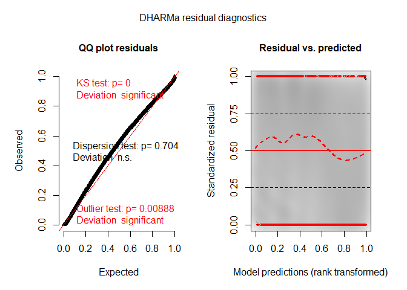<!-- -->

``` r
bartlett.test(list(residuals(reg), fitted(reg)))
```

    ## 
    ##  Bartlett test of homogeneity of variances
    ## 
    ## data:  list(residuals(reg), fitted(reg))
    ## Bartlett's K-squared = 18759, df = 1, p-value <
    ## 0.00000000000000022

``` r
qqmath(reg)
```

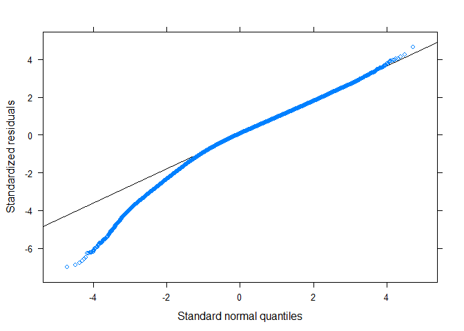<!-- -->

``` r
Plot.reg <- plot(reg) #creates a fitted vs residual plot
Plot.reg
```

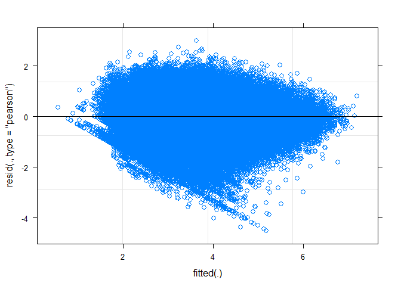<!-- -->

``` r
reg4<-lm(formula= UNITS~PRICE*Product,data=df)

AIC(reg4)
```

    ## [1] 3886413

``` r
summary(reg4)
```

    ## 
    ## Call:
    ## lm(formula = UNITS ~ PRICE * Product, data = df)
    ## 
    ## Residuals:
    ##     Min      1Q  Median      3Q     Max 
    ## -207.20   -9.92   -2.52    5.40 1611.64 
    ## 
    ## Coefficients:
    ##                                                 Estimate Std. Error
    ## (Intercept)                                      63.2345     1.6385
    ## PRICE                                            -8.5992     0.2718
    ## ProductDIGRN PEPP PIZZA_28.3 OZ                  40.4405     2.3149
    ## ProductDIGRN SUPREME PIZZA_32.7 OZ               15.8004     2.3139
    ## ProductFRSC 4 CHEESE PIZZA_26.11 OZ             -26.8225     2.3582
    ## ProductFRSC BRCK OVN ITL PEP PZ_22.7 OZ         -12.8683     2.2791
    ## ProductFRSC PEPPERONI PIZZA_27.35 OZ            -13.6368     2.2971
    ## ProductGM CHEERIOS_12 OZ                         37.1855     2.2217
    ## ProductGM CHEERIOS_18 OZ                        124.0573     2.3869
    ## ProductGM HONEY NUT CHEERIOS_12.25 OZ           301.1825     2.3653
    ## ProductKELL BITE SIZE MINI WHEAT_18 OZ           41.7457     2.5208
    ## ProductKELL FROOT LOOPS_12.2 OZ                 234.4642     2.2719
    ## ProductKELL FROSTED FLAKES_15 OZ                230.5000     2.3806
    ## ProductMKSL DUTCH PRETZELS_16 OZ                -45.0251     3.8962
    ## ProductMKSL MINI TWIST PRETZELS_16 OZ           -39.5600     3.8054
    ## ProductMKSL PRETZEL STICKS_16 OZ                -44.9411     3.9109
    ## ProductNWMN OWN 4 CHEESE PIZZA_13.3 OZ          -29.5167     5.1783
    ## ProductNWMN OWN PEPPERONI PIZZA_13.2 OZ         -26.7712     4.4878
    ## ProductNWMN OWN SUPREME PIZZA_14.7 OZ           -33.7767     5.4819
    ## ProductPL BT SZ FRSTD SHRD WHT_18 OZ             11.4492     2.8594
    ## ProductPL HONEY NUT TOASTD OATS_12.25 OZ        -47.3137     3.5949
    ## ProductPL MINI TWIST PRETZELS_15 OZ            -111.2857     2.2019
    ## ProductPL PRETZEL STICKS_15 OZ                  -78.3776     2.2060
    ## ProductPL RAISIN BRAN_20 OZ                     -17.9240     3.6030
    ## ProductPL SR CRUST 3 MEAT PIZZA_30.5 OZ         -24.2757     2.2872
    ## ProductPL SR CRUST PEPPRN PIZZA_29.6 OZ         -23.7456     2.2756
    ## ProductPL SR CRUST SUPRM PIZZA_32.7 OZ          -29.1070     2.2532
    ## ProductPL TWIST PRETZELS_15 OZ                  -81.0039     2.2554
    ## ProductPOST FM SZ HNYBNCH OT ALM_18 OZ           45.2905     3.2347
    ## ProductPOST FRUITY PEBBLES_11 OZ                113.3638     2.4347
    ## ProductPOST HNY BN OTS HNY RSTD_18 OZ            47.8336     3.5297
    ## ProductQKER CAP N CRUNCH BERRIES_13 OZ          139.2572     2.6168
    ## ProductQKER CAP N CRUNCH_14 OZ                  107.1108     2.4973
    ## ProductQKER LIFE ORIGINAL_13 OZ                  15.9189     2.0898
    ## ProductRLDGLD BRAIDED HONEY WHT_10 OZ           -38.0581     3.1698
    ## ProductRLDGLD PRETZEL STICKS_16 OZ              -14.9341     2.9555
    ## ProductRLDGLD TINY TWISTS PRTZL_16 OZ            -1.3309     2.9352
    ## ProductSHURGD MINI PRETZELS_16 OZ               -31.2623     2.4963
    ## ProductSHURGD PRETZEL RODS_12 OZ                -36.6690     2.5759
    ## ProductSHURGD PRETZEL STICKS_16 OZ              -30.8054     2.5440
    ## ProductSNYDR FF MINI PRETZELS_16 OZ             -25.4974     2.8974
    ## ProductSNYDR PRETZEL RODS_10 OZ                 -19.3709     2.7276
    ## ProductSNYDR SOURDOUGH NIBBLERS_16 OZ           -22.4713     2.9417
    ## PRICE:ProductDIGRN PEPP PIZZA_28.3 OZ            -5.1075     0.3837
    ## PRICE:ProductDIGRN SUPREME PIZZA_32.7 OZ         -1.9495     0.3837
    ## PRICE:ProductFRSC 4 CHEESE PIZZA_26.11 OZ         3.8539     0.3801
    ## PRICE:ProductFRSC BRCK OVN ITL PEP PZ_22.7 OZ     1.8948     0.3678
    ## PRICE:ProductFRSC PEPPERONI PIZZA_27.35 OZ        1.9304     0.3709
    ## PRICE:ProductGM CHEERIOS_12 OZ                  -12.1060     0.6014
    ## PRICE:ProductGM CHEERIOS_18 OZ                  -28.0780     0.4861
    ## PRICE:ProductGM HONEY NUT CHEERIOS_12.25 OZ     -98.7532     0.6687
    ## PRICE:ProductKELL BITE SIZE MINI WHEAT_18 OZ    -14.0379     0.6596
    ## PRICE:ProductKELL FROOT LOOPS_12.2 OZ           -79.7999     0.5967
    ## PRICE:ProductKELL FROSTED FLAKES_15 OZ          -76.7400     0.6518
    ## PRICE:ProductMKSL DUTCH PRETZELS_16 OZ            3.4661     1.5718
    ## PRICE:ProductMKSL MINI TWIST PRETZELS_16 OZ       1.2461     1.5302
    ## PRICE:ProductMKSL PRETZEL STICKS_16 OZ            2.8314     1.5869
    ## PRICE:ProductNWMN OWN 4 CHEESE PIZZA_13.3 OZ      4.1146     0.8577
    ## PRICE:ProductNWMN OWN PEPPERONI PIZZA_13.2 OZ     3.6386     0.7433
    ## PRICE:ProductNWMN OWN SUPREME PIZZA_14.7 OZ       4.5551     0.9060
    ## PRICE:ProductPL BT SZ FRSTD SHRD WHT_18 OZ       -8.1505     1.1250
    ## PRICE:ProductPL HONEY NUT TOASTD OATS_12.25 OZ   11.9188     1.8343
    ## PRICE:ProductPL MINI TWIST PRETZELS_15 OZ        88.9215     1.1528
    ## PRICE:ProductPL PRETZEL STICKS_15 OZ             54.6043     1.1557
    ## PRICE:ProductPL RAISIN BRAN_20 OZ                 0.2907     1.8431
    ## PRICE:ProductPL SR CRUST 3 MEAT PIZZA_30.5 OZ     1.2226     0.5185
    ## PRICE:ProductPL SR CRUST PEPPRN PIZZA_29.6 OZ     1.8802     0.5128
    ## PRICE:ProductPL SR CRUST SUPRM PIZZA_32.7 OZ      2.4523     0.5065
    ## PRICE:ProductPL TWIST PRETZELS_15 OZ             39.3261     1.2019
    ## PRICE:ProductPOST FM SZ HNYBNCH OT ALM_18 OZ    -17.1129     0.9048
    ## PRICE:ProductPOST FRUITY PEBBLES_11 OZ          -49.2318     0.7487
    ## PRICE:ProductPOST HNY BN OTS HNY RSTD_18 OZ     -17.2358     1.0132
    ## PRICE:ProductQKER CAP N CRUNCH BERRIES_13 OZ    -59.4660     0.8576
    ## PRICE:ProductQKER CAP N CRUNCH_14 OZ            -50.4560     0.8012
    ## PRICE:ProductQKER LIFE ORIGINAL_13 OZ           -14.1320     0.5386
    ## PRICE:ProductRLDGLD BRAIDED HONEY WHT_10 OZ       2.8299     0.9748
    ## PRICE:ProductRLDGLD PRETZEL STICKS_16 OZ         -4.3797     0.8917
    ## PRICE:ProductRLDGLD TINY TWISTS PRTZL_16 OZ      -7.8868     0.8829
    ## PRICE:ProductSHURGD MINI PRETZELS_16 OZ           3.8013     1.0882
    ## PRICE:ProductSHURGD PRETZEL RODS_12 OZ            3.8988     1.1014
    ## PRICE:ProductSHURGD PRETZEL STICKS_16 OZ          3.5427     1.1180
    ## PRICE:ProductSNYDR FF MINI PRETZELS_16 OZ        -0.3152     0.8805
    ## PRICE:ProductSNYDR PRETZEL RODS_10 OZ            -5.6324     0.9657
    ## PRICE:ProductSNYDR SOURDOUGH NIBBLERS_16 OZ      -1.0646     0.8988
    ##                                                 t value
    ## (Intercept)                                      38.593
    ## PRICE                                           -31.633
    ## ProductDIGRN PEPP PIZZA_28.3 OZ                  17.470
    ## ProductDIGRN SUPREME PIZZA_32.7 OZ                6.828
    ## ProductFRSC 4 CHEESE PIZZA_26.11 OZ             -11.374
    ## ProductFRSC BRCK OVN ITL PEP PZ_22.7 OZ          -5.646
    ## ProductFRSC PEPPERONI PIZZA_27.35 OZ             -5.937
    ## ProductGM CHEERIOS_12 OZ                         16.737
    ## ProductGM CHEERIOS_18 OZ                         51.973
    ## ProductGM HONEY NUT CHEERIOS_12.25 OZ           127.336
    ## ProductKELL BITE SIZE MINI WHEAT_18 OZ           16.560
    ## ProductKELL FROOT LOOPS_12.2 OZ                 103.200
    ## ProductKELL FROSTED FLAKES_15 OZ                 96.823
    ## ProductMKSL DUTCH PRETZELS_16 OZ                -11.556
    ## ProductMKSL MINI TWIST PRETZELS_16 OZ           -10.396
    ## ProductMKSL PRETZEL STICKS_16 OZ                -11.491
    ## ProductNWMN OWN 4 CHEESE PIZZA_13.3 OZ           -5.700
    ## ProductNWMN OWN PEPPERONI PIZZA_13.2 OZ          -5.965
    ## ProductNWMN OWN SUPREME PIZZA_14.7 OZ            -6.162
    ## ProductPL BT SZ FRSTD SHRD WHT_18 OZ              4.004
    ## ProductPL HONEY NUT TOASTD OATS_12.25 OZ        -13.161
    ## ProductPL MINI TWIST PRETZELS_15 OZ             -50.542
    ## ProductPL PRETZEL STICKS_15 OZ                  -35.529
    ## ProductPL RAISIN BRAN_20 OZ                      -4.975
    ## ProductPL SR CRUST 3 MEAT PIZZA_30.5 OZ         -10.614
    ## ProductPL SR CRUST PEPPRN PIZZA_29.6 OZ         -10.435
    ## ProductPL SR CRUST SUPRM PIZZA_32.7 OZ          -12.918
    ## ProductPL TWIST PRETZELS_15 OZ                  -35.915
    ## ProductPOST FM SZ HNYBNCH OT ALM_18 OZ           14.002
    ## ProductPOST FRUITY PEBBLES_11 OZ                 46.561
    ## ProductPOST HNY BN OTS HNY RSTD_18 OZ            13.552
    ## ProductQKER CAP N CRUNCH BERRIES_13 OZ           53.216
    ## ProductQKER CAP N CRUNCH_14 OZ                   42.890
    ## ProductQKER LIFE ORIGINAL_13 OZ                   7.617
    ## ProductRLDGLD BRAIDED HONEY WHT_10 OZ           -12.006
    ## ProductRLDGLD PRETZEL STICKS_16 OZ               -5.053
    ## ProductRLDGLD TINY TWISTS PRTZL_16 OZ            -0.453
    ## ProductSHURGD MINI PRETZELS_16 OZ               -12.523
    ## ProductSHURGD PRETZEL RODS_12 OZ                -14.235
    ## ProductSHURGD PRETZEL STICKS_16 OZ              -12.109
    ## ProductSNYDR FF MINI PRETZELS_16 OZ              -8.800
    ## ProductSNYDR PRETZEL RODS_10 OZ                  -7.102
    ## ProductSNYDR SOURDOUGH NIBBLERS_16 OZ            -7.639
    ## PRICE:ProductDIGRN PEPP PIZZA_28.3 OZ           -13.311
    ## PRICE:ProductDIGRN SUPREME PIZZA_32.7 OZ         -5.081
    ## PRICE:ProductFRSC 4 CHEESE PIZZA_26.11 OZ        10.140
    ## PRICE:ProductFRSC BRCK OVN ITL PEP PZ_22.7 OZ     5.152
    ## PRICE:ProductFRSC PEPPERONI PIZZA_27.35 OZ        5.205
    ## PRICE:ProductGM CHEERIOS_12 OZ                  -20.130
    ## PRICE:ProductGM CHEERIOS_18 OZ                  -57.764
    ## PRICE:ProductGM HONEY NUT CHEERIOS_12.25 OZ    -147.674
    ## PRICE:ProductKELL BITE SIZE MINI WHEAT_18 OZ    -21.282
    ## PRICE:ProductKELL FROOT LOOPS_12.2 OZ          -133.741
    ## PRICE:ProductKELL FROSTED FLAKES_15 OZ         -117.728
    ## PRICE:ProductMKSL DUTCH PRETZELS_16 OZ            2.205
    ## PRICE:ProductMKSL MINI TWIST PRETZELS_16 OZ       0.814
    ## PRICE:ProductMKSL PRETZEL STICKS_16 OZ            1.784
    ## PRICE:ProductNWMN OWN 4 CHEESE PIZZA_13.3 OZ      4.797
    ## PRICE:ProductNWMN OWN PEPPERONI PIZZA_13.2 OZ     4.896
    ## PRICE:ProductNWMN OWN SUPREME PIZZA_14.7 OZ       5.027
    ## PRICE:ProductPL BT SZ FRSTD SHRD WHT_18 OZ       -7.245
    ## PRICE:ProductPL HONEY NUT TOASTD OATS_12.25 OZ    6.498
    ## PRICE:ProductPL MINI TWIST PRETZELS_15 OZ        77.136
    ## PRICE:ProductPL PRETZEL STICKS_15 OZ             47.246
    ## PRICE:ProductPL RAISIN BRAN_20 OZ                 0.158
    ## PRICE:ProductPL SR CRUST 3 MEAT PIZZA_30.5 OZ     2.358
    ## PRICE:ProductPL SR CRUST PEPPRN PIZZA_29.6 OZ     3.666
    ## PRICE:ProductPL SR CRUST SUPRM PIZZA_32.7 OZ      4.841
    ## PRICE:ProductPL TWIST PRETZELS_15 OZ             32.721
    ## PRICE:ProductPOST FM SZ HNYBNCH OT ALM_18 OZ    -18.914
    ## PRICE:ProductPOST FRUITY PEBBLES_11 OZ          -65.755
    ## PRICE:ProductPOST HNY BN OTS HNY RSTD_18 OZ     -17.012
    ## PRICE:ProductQKER CAP N CRUNCH BERRIES_13 OZ    -69.336
    ## PRICE:ProductQKER CAP N CRUNCH_14 OZ            -62.977
    ## PRICE:ProductQKER LIFE ORIGINAL_13 OZ           -26.239
    ## PRICE:ProductRLDGLD BRAIDED HONEY WHT_10 OZ       2.903
    ## PRICE:ProductRLDGLD PRETZEL STICKS_16 OZ         -4.912
    ## PRICE:ProductRLDGLD TINY TWISTS PRTZL_16 OZ      -8.933
    ## PRICE:ProductSHURGD MINI PRETZELS_16 OZ           3.493
    ## PRICE:ProductSHURGD PRETZEL RODS_12 OZ            3.540
    ## PRICE:ProductSHURGD PRETZEL STICKS_16 OZ          3.169
    ## PRICE:ProductSNYDR FF MINI PRETZELS_16 OZ        -0.358
    ## PRICE:ProductSNYDR PRETZEL RODS_10 OZ            -5.832
    ## PRICE:ProductSNYDR SOURDOUGH NIBBLERS_16 OZ      -1.185
    ##                                                            Pr(>|t|)    
    ## (Intercept)                                    < 0.0000000000000002 ***
    ## PRICE                                          < 0.0000000000000002 ***
    ## ProductDIGRN PEPP PIZZA_28.3 OZ                < 0.0000000000000002 ***
    ## ProductDIGRN SUPREME PIZZA_32.7 OZ               0.0000000000085929 ***
    ## ProductFRSC 4 CHEESE PIZZA_26.11 OZ            < 0.0000000000000002 ***
    ## ProductFRSC BRCK OVN ITL PEP PZ_22.7 OZ          0.0000000164102696 ***
    ## ProductFRSC PEPPERONI PIZZA_27.35 OZ             0.0000000029112706 ***
    ## ProductGM CHEERIOS_12 OZ                       < 0.0000000000000002 ***
    ## ProductGM CHEERIOS_18 OZ                       < 0.0000000000000002 ***
    ## ProductGM HONEY NUT CHEERIOS_12.25 OZ          < 0.0000000000000002 ***
    ## ProductKELL BITE SIZE MINI WHEAT_18 OZ         < 0.0000000000000002 ***
    ## ProductKELL FROOT LOOPS_12.2 OZ                < 0.0000000000000002 ***
    ## ProductKELL FROSTED FLAKES_15 OZ               < 0.0000000000000002 ***
    ## ProductMKSL DUTCH PRETZELS_16 OZ               < 0.0000000000000002 ***
    ## ProductMKSL MINI TWIST PRETZELS_16 OZ          < 0.0000000000000002 ***
    ## ProductMKSL PRETZEL STICKS_16 OZ               < 0.0000000000000002 ***
    ## ProductNWMN OWN 4 CHEESE PIZZA_13.3 OZ           0.0000000119860135 ***
    ## ProductNWMN OWN PEPPERONI PIZZA_13.2 OZ          0.0000000024438819 ***
    ## ProductNWMN OWN SUPREME PIZZA_14.7 OZ            0.0000000007210756 ***
    ## ProductPL BT SZ FRSTD SHRD WHT_18 OZ             0.0000622734574399 ***
    ## ProductPL HONEY NUT TOASTD OATS_12.25 OZ       < 0.0000000000000002 ***
    ## ProductPL MINI TWIST PRETZELS_15 OZ            < 0.0000000000000002 ***
    ## ProductPL PRETZEL STICKS_15 OZ                 < 0.0000000000000002 ***
    ## ProductPL RAISIN BRAN_20 OZ                      0.0000006533933899 ***
    ## ProductPL SR CRUST 3 MEAT PIZZA_30.5 OZ        < 0.0000000000000002 ***
    ## ProductPL SR CRUST PEPPRN PIZZA_29.6 OZ        < 0.0000000000000002 ***
    ## ProductPL SR CRUST SUPRM PIZZA_32.7 OZ         < 0.0000000000000002 ***
    ## ProductPL TWIST PRETZELS_15 OZ                 < 0.0000000000000002 ***
    ## ProductPOST FM SZ HNYBNCH OT ALM_18 OZ         < 0.0000000000000002 ***
    ## ProductPOST FRUITY PEBBLES_11 OZ               < 0.0000000000000002 ***
    ## ProductPOST HNY BN OTS HNY RSTD_18 OZ          < 0.0000000000000002 ***
    ## ProductQKER CAP N CRUNCH BERRIES_13 OZ         < 0.0000000000000002 ***
    ## ProductQKER CAP N CRUNCH_14 OZ                 < 0.0000000000000002 ***
    ## ProductQKER LIFE ORIGINAL_13 OZ                  0.0000000000000259 ***
    ## ProductRLDGLD BRAIDED HONEY WHT_10 OZ          < 0.0000000000000002 ***
    ## ProductRLDGLD PRETZEL STICKS_16 OZ               0.0000004352482020 ***
    ## ProductRLDGLD TINY TWISTS PRTZL_16 OZ                      0.650252    
    ## ProductSHURGD MINI PRETZELS_16 OZ              < 0.0000000000000002 ***
    ## ProductSHURGD PRETZEL RODS_12 OZ               < 0.0000000000000002 ***
    ## ProductSHURGD PRETZEL STICKS_16 OZ             < 0.0000000000000002 ***
    ## ProductSNYDR FF MINI PRETZELS_16 OZ            < 0.0000000000000002 ***
    ## ProductSNYDR PRETZEL RODS_10 OZ                  0.0000000000012321 ***
    ## ProductSNYDR SOURDOUGH NIBBLERS_16 OZ            0.0000000000000219 ***
    ## PRICE:ProductDIGRN PEPP PIZZA_28.3 OZ          < 0.0000000000000002 ***
    ## PRICE:ProductDIGRN SUPREME PIZZA_32.7 OZ         0.0000003752484974 ***
    ## PRICE:ProductFRSC 4 CHEESE PIZZA_26.11 OZ      < 0.0000000000000002 ***
    ## PRICE:ProductFRSC BRCK OVN ITL PEP PZ_22.7 OZ    0.0000002582438718 ***
    ## PRICE:ProductFRSC PEPPERONI PIZZA_27.35 OZ       0.0000001940688214 ***
    ## PRICE:ProductGM CHEERIOS_12 OZ                 < 0.0000000000000002 ***
    ## PRICE:ProductGM CHEERIOS_18 OZ                 < 0.0000000000000002 ***
    ## PRICE:ProductGM HONEY NUT CHEERIOS_12.25 OZ    < 0.0000000000000002 ***
    ## PRICE:ProductKELL BITE SIZE MINI WHEAT_18 OZ   < 0.0000000000000002 ***
    ## PRICE:ProductKELL FROOT LOOPS_12.2 OZ          < 0.0000000000000002 ***
    ## PRICE:ProductKELL FROSTED FLAKES_15 OZ         < 0.0000000000000002 ***
    ## PRICE:ProductMKSL DUTCH PRETZELS_16 OZ                     0.027445 *  
    ## PRICE:ProductMKSL MINI TWIST PRETZELS_16 OZ                0.415460    
    ## PRICE:ProductMKSL PRETZEL STICKS_16 OZ                     0.074382 .  
    ## PRICE:ProductNWMN OWN 4 CHEESE PIZZA_13.3 OZ     0.0000016075842218 ***
    ## PRICE:ProductNWMN OWN PEPPERONI PIZZA_13.2 OZ    0.0000009807587998 ***
    ## PRICE:ProductNWMN OWN SUPREME PIZZA_14.7 OZ      0.0000004971789649 ***
    ## PRICE:ProductPL BT SZ FRSTD SHRD WHT_18 OZ       0.0000000000004336 ***
    ## PRICE:ProductPL HONEY NUT TOASTD OATS_12.25 OZ   0.0000000000817156 ***
    ## PRICE:ProductPL MINI TWIST PRETZELS_15 OZ      < 0.0000000000000002 ***
    ## PRICE:ProductPL PRETZEL STICKS_15 OZ           < 0.0000000000000002 ***
    ## PRICE:ProductPL RAISIN BRAN_20 OZ                          0.874682    
    ## PRICE:ProductPL SR CRUST 3 MEAT PIZZA_30.5 OZ              0.018383 *  
    ## PRICE:ProductPL SR CRUST PEPPRN PIZZA_29.6 OZ              0.000246 ***
    ## PRICE:ProductPL SR CRUST SUPRM PIZZA_32.7 OZ     0.0000012896455771 ***
    ## PRICE:ProductPL TWIST PRETZELS_15 OZ           < 0.0000000000000002 ***
    ## PRICE:ProductPOST FM SZ HNYBNCH OT ALM_18 OZ   < 0.0000000000000002 ***
    ## PRICE:ProductPOST FRUITY PEBBLES_11 OZ         < 0.0000000000000002 ***
    ## PRICE:ProductPOST HNY BN OTS HNY RSTD_18 OZ    < 0.0000000000000002 ***
    ## PRICE:ProductQKER CAP N CRUNCH BERRIES_13 OZ   < 0.0000000000000002 ***
    ## PRICE:ProductQKER CAP N CRUNCH_14 OZ           < 0.0000000000000002 ***
    ## PRICE:ProductQKER LIFE ORIGINAL_13 OZ          < 0.0000000000000002 ***
    ## PRICE:ProductRLDGLD BRAIDED HONEY WHT_10 OZ                0.003695 ** 
    ## PRICE:ProductRLDGLD PRETZEL STICKS_16 OZ         0.0000009039221616 ***
    ## PRICE:ProductRLDGLD TINY TWISTS PRTZL_16 OZ    < 0.0000000000000002 ***
    ## PRICE:ProductSHURGD MINI PRETZELS_16 OZ                    0.000477 ***
    ## PRICE:ProductSHURGD PRETZEL RODS_12 OZ                     0.000400 ***
    ## PRICE:ProductSHURGD PRETZEL STICKS_16 OZ                   0.001531 ** 
    ## PRICE:ProductSNYDR FF MINI PRETZELS_16 OZ                  0.720349    
    ## PRICE:ProductSNYDR PRETZEL RODS_10 OZ            0.0000000054759273 ***
    ## PRICE:ProductSNYDR SOURDOUGH NIBBLERS_16 OZ                0.236200    
    ## ---
    ## Signif. codes:  0 '***' 0.001 '**' 0.01 '*' 0.05 '.' 0.1 ' ' 1
    ## 
    ## Residual standard error: 25.12 on 418469 degrees of freedom
    ## Multiple R-squared:  0.4021, Adjusted R-squared:  0.402 
    ## F-statistic:  3391 on 83 and 418469 DF,  p-value: < 0.00000000000000022

``` r
product_summary2 <- df %>% 
  group_by(Product) %>%
  summarise(UNITS = mean(UNITS), 
            SPEND = sum(SPEND), 
            PRICE = mean(PRICE), 
            BASE_PRICE = mean(BASE_PRICE)) %>%
  arrange(Product)

glimpse(product_summary2)
```

    ## Rows: 42
    ## Columns: 5
    ## $ Product    <fct> DIGIORNO THREE MEAT_29.8 OZ, DIGRN PEPP PIZZA_28.3 ...
    ## $ UNITS      <dbl> 11.909887, 21.712051, 15.993786, 6.483027, 8.002895...
    ## $ SPEND      <dbl> 787193.76, 1475513.58, 1078161.34, 324937.29, 47251...
    ## $ PRICE      <dbl> 5.968510, 5.979742, 5.976195, 6.307008, 6.318718, 6...
    ## $ BASE_PRICE <dbl> 6.555697, 6.551671, 6.552904, 6.890563, 6.883275, 6...

``` r
coef<-coefficients(reg4)
coef<-as.data.frame(coef)
coef <- cbind(Var = rownames(coef), coef)
```

``` r
coef$Var2<-as.character(coef$Var)

coef$Product<-substr(coef$Var2,14,nchar(coef$Var2))

coef$Var<-NULL
coef$Var2<-NULL
```

``` r
c2<-merge(product_summary2, coef, by = 'Product')
```

``` r
c2$PriceOverQuantity<-c2$PRICE/c2$UNITS
c2$PriceElasticity<-round(c2$coef*c2$PriceOverQuantity,3)
c3<-c2[order(-c2$PriceElasticity),]
```

``` r
library(openxlsx)
write.xlsx(c3, 'priceelasticity.xlsx')
```

    ## Note: zip::zip() is deprecated, please use zip::zipr() instead

``` r
write.xlsx(df, 'joined.xlsx')
```

``` r
c3$AverageProfit<-c3$PRICE-c3$BASE_PRICE
```
